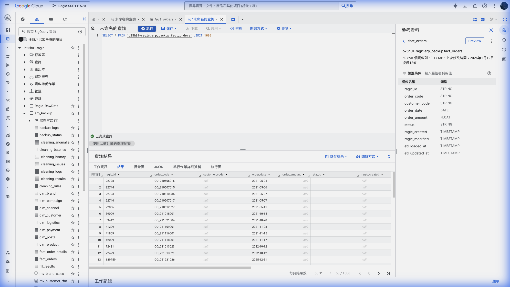
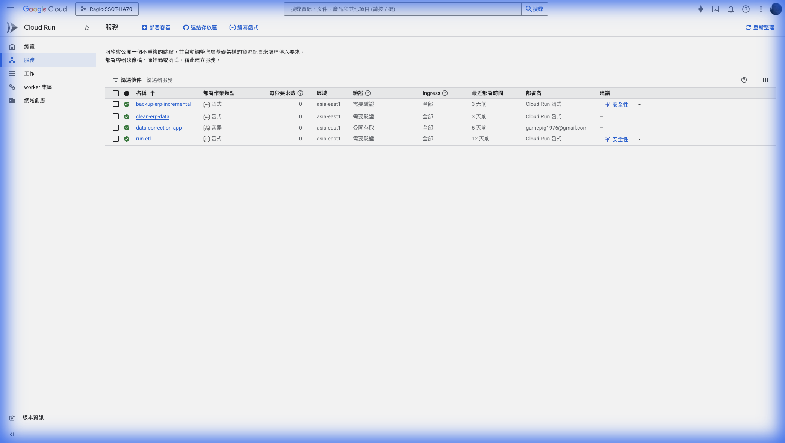
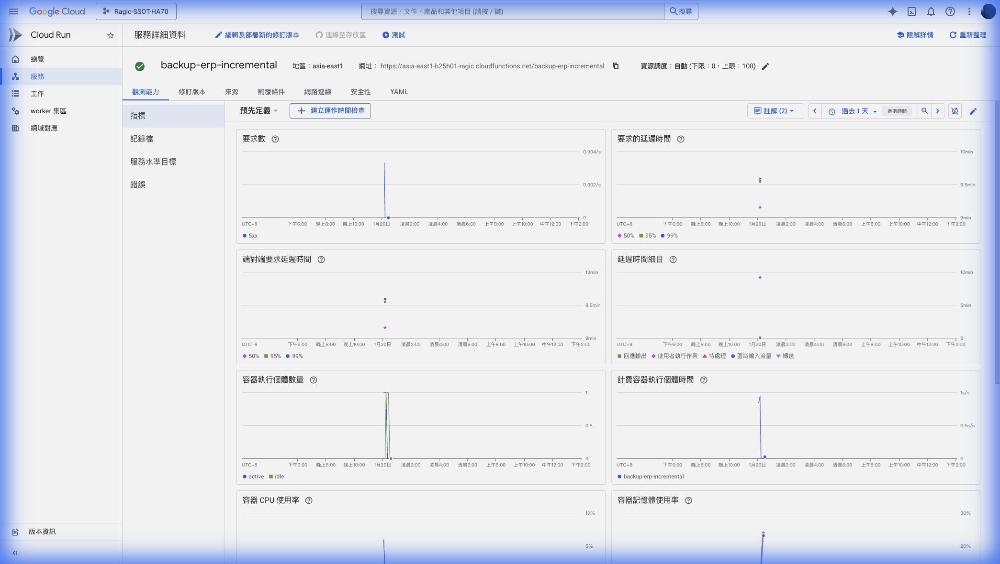
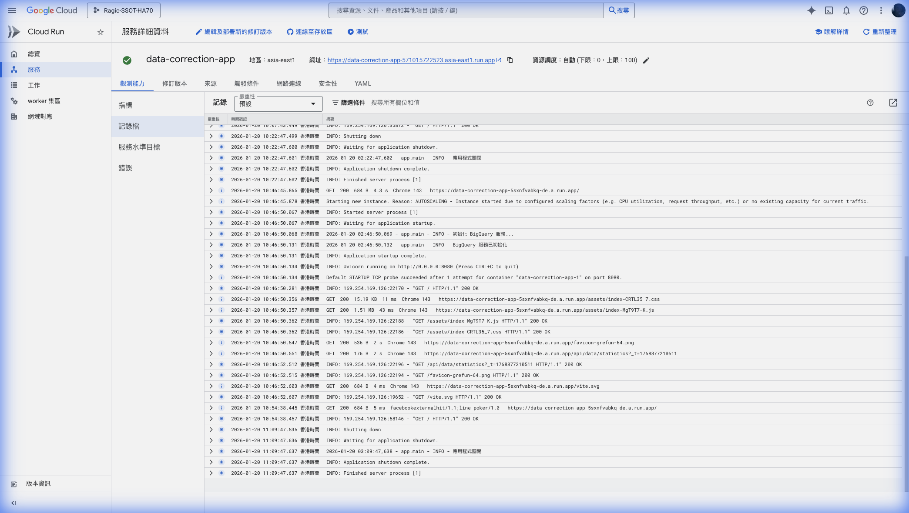
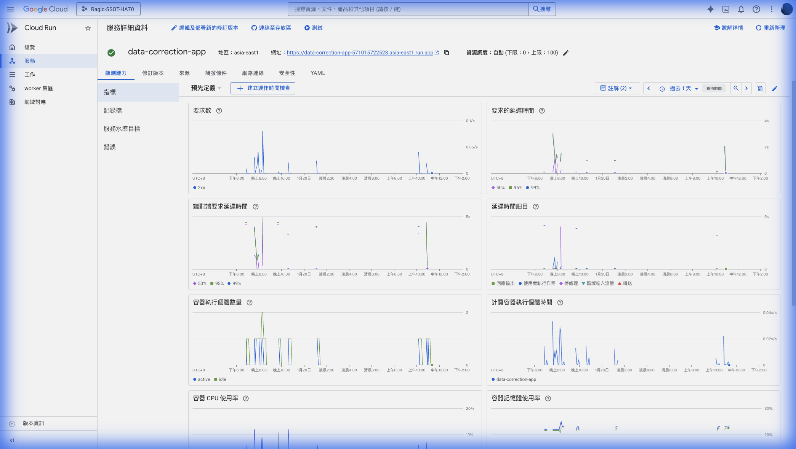
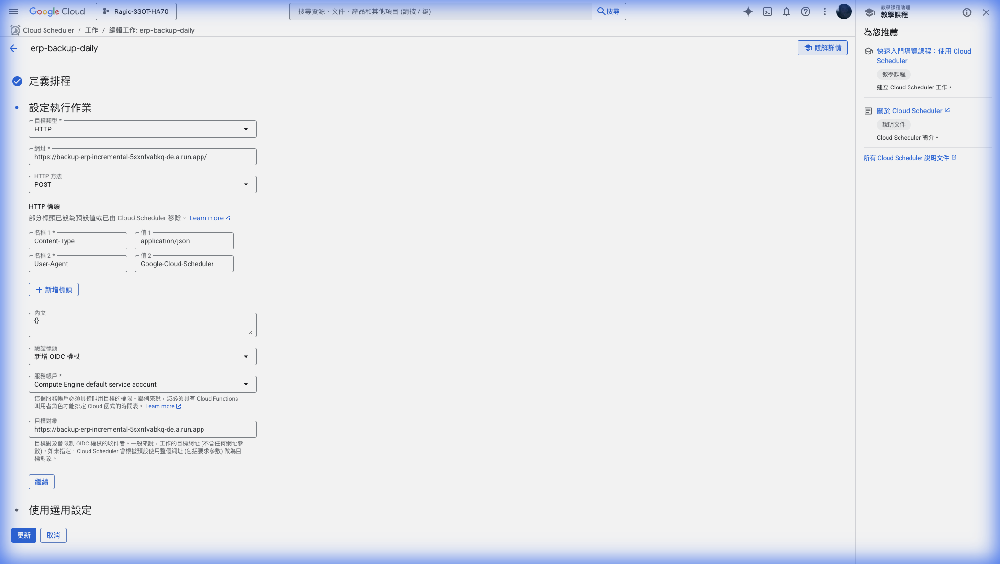

# GCP 非技術人員操作指南

## 📘 ERP 數據管道系統 - 客戶操作手冊

**版本**: 1.0  
**最後更新**: 2026-01-20  
**專案代碼**: b25h01-ragic

---

## 目錄

1. [系統概述](#1-系統概述)
2. [登入 Google Cloud Console](#2-登入-google-cloud-console)
3. [BigQuery 資料查詢](#3-bigquery-資料查詢)
4. [Cloud Run 服務管理](#4-cloud-run-服務管理)
5. [排程任務管理](#5-排程任務管理)
6. [資料手動校正介面](#6-資料手動校正介面)
7. [常見問題排解](#7-常見問題排解)
8. [緊急聯絡方式](#8-緊急聯絡方式)

---

## 1. 系統概述

### 🎯 系統用途

本系統是一套 **ERP 資料清洗與備份自動化解決方案**，主要功能包括：

| 功能 | 說明 |
|------|------|
| 📦 **自動備份** | 每日自動從 Ragic ERP 擷取訂單資料 |
| 🧹 **資料清洗** | AI 自動識別並修正資料品質問題 |
| ✏️ **人工校正** | 提供 Web 介面讓您處理 AI 無法處理的資料 |
| 📊 **資料倉儲** | 清洗後的資料統一儲存於 BigQuery |

### 🏗️ 架構示意圖

```
┌─────────────┐     ┌──────────────────┐     ┌─────────────┐
│  Ragic ERP  │ ──▶ │  Cloud Run 函數   │ ──▶ │  BigQuery   │
│  (來源資料)  │     │  (自動處理)       │     │  (資料倉儲)  │
└─────────────┘     └──────────────────┘     └─────────────┘
                           │
                           ▼
                    ┌──────────────────┐
                    │  人工校正 Web App │
                    │  (處理例外)       │
                    └──────────────────┘
```

### 🔗 重要連結

| 名稱 | 網址 |
|------|------|
| GCP Console | https://console.cloud.google.com/?project=b25h01-ragic |
| BigQuery 資料查詢 | https://console.cloud.google.com/bigquery?project=b25h01-ragic |
| Cloud Run 服務 | https://console.cloud.google.com/run?project=b25h01-ragic |
| 排程任務管理 | https://console.cloud.google.com/cloudscheduler?project=b25h01-ragic |
| 資料校正應用 | https://data-correction-app-5sxnfvabkq-de.a.run.app |

---

## 2. 登入 Google Cloud Console

### 步驟說明

1. **開啟瀏覽器**，前往 [Google Cloud Console](https://console.cloud.google.com/)

2. **使用 Google 帳號登入**
   - 使用您被授權的 Google 帳號
   - 若有多個帳號，請選擇正確的帳號

3. **選擇專案**
   - 點擊頁面左上角的專案選擇器
   - 搜尋 `b25h01-ragic`
   - 點擊選擇此專案

### 💡 小提示

> 如果您無法看到專案，請聯絡管理員將您的帳號加入專案權限

---

## 3. BigQuery 資料查詢

BigQuery 是您查看所有 ERP 資料的地方。

### 📸 操作介面預覽



### 3.1 進入 BigQuery

1. 在 GCP Console 左側選單，找到 **BigQuery**
2. 或直接點擊：[BigQuery Console](https://console.cloud.google.com/bigquery?project=b25h01-ragic)

### 3.2 瀏覽資料表

在左側面板中，您會看到以下資料集結構：

```
b25h01-ragic
├── Ragic_RawData        ← 原始資料
│   └── my_backup        ← 原始備份
├── backup_logs          ← 備份日誌
│   └── incremental_*    ← 增量備份紀錄
├── cleaning_batches     ← 清洗批次
├── cleaning_results     ← 清洗結果
├── dim_*                ← 維度表 (客戶、產品等)
└── fact_orders          ← 訂單事實表 ⭐ 主要資料
```

### 3.3 常用查詢範例

#### 📋 查看最新訂單

```sql
SELECT *
FROM `b25h01-ragic.erp_backup.fact_orders`
ORDER BY ragic_modified DESC
LIMIT 100
```

#### 📊 統計今日訂單總額

```sql
SELECT 
  COUNT(*) as 訂單數,
  SUM(order_amount) as 總金額
FROM `b25h01-ragic.erp_backup.fact_orders`
WHERE DATE(ragic_created) = CURRENT_DATE()
```

#### 🔍 查詢特定客戶訂單

```sql
SELECT *
FROM `b25h01-ragic.erp_backup.fact_orders`
WHERE customer_code = '您的客戶代碼'
ORDER BY ragic_created DESC
```

### 3.4 如何執行查詢

1. 在 BigQuery 編輯器中輸入 SQL
2. 點擊 **執行** 按鈕 (或按 `Ctrl+Enter`)
3. 查詢結果會顯示在下方

### 3.5 匯出資料

1. 執行查詢後，點擊結果區的 **儲存結果**
2. 選擇匯出格式：
   - **CSV** - 適合 Excel 開啟
   - **JSON** - 適合程式處理
   - **Google 試算表** - 直接存入 Google Sheets

---

## 4. Cloud Run 服務管理

### 📸 服務列表



### 4.1 服務說明

| 服務名稱 | 用途 | 狀態說明 |
|---------|------|---------|
| `backup-erp-incremental` | 增量備份 ERP 資料 | 每日自動執行 |
| `clean-erp-data` | AI 自動清洗資料 | 備份後自動執行 |
| `run-etl` | 資料轉換載入 | 清洗後自動執行 |
| `data-correction-app` | 人工校正網頁應用 | 持續運行中 |

### 4.2 查看服務狀態



1. 前往 [Cloud Run](https://console.cloud.google.com/run?project=b25h01-ragic)
2. 點擊任一服務名稱
3. 在「**觀察能力**」分頁查看：
   - **請求數** - 服務被呼叫的次數
   - **延遲時間** - 回應時間
   - **錯誤率** - 失敗比例

### 4.3 查看應用程式日誌



1. 進入服務詳情頁
2. 點擊「**觀察能力**」→「**記錄檔**」
3. 您可以看到：
   - 容器啟動訊息
   - HTTP 請求紀錄
   - 錯誤訊息（如有）

### 4.4 監控儀表板



每個服務的儀表板顯示：
- **請求數** (Request count)
- **要求的延遲時間** (Request latency)
- **容器執行個體數量** (Container instances)
- **CPU 使用率** (CPU utilization)
- **記憶體使用率** (Memory utilization)

---

## 5. 排程任務管理

### 5.1 進入排程管理

1. 前往 [Cloud Scheduler](https://console.cloud.google.com/cloudscheduler?project=b25h01-ragic)
2. 您會看到所有已設定的排程任務

### 5.2 現有排程任務

| 任務名稱 | 執行時間 | 說明 |
|---------|---------|------|
| `erp-backup-daily` | 每日 00:00 | 執行 ERP 資料增量備份 |

### 5.3 排程任務設定



排程設定說明：
- **定義排程**: `0 0 * * *` (Cron 格式，表示每日午夜)
- **目標類型**: HTTP POST
- **目標 URL**: Cloud Run 服務的網址
- **驗證方式**: 使用 OIDC Token 自動驗證

### 5.4 手動執行任務

當您需要立即執行備份時：

1. 在任務列表中找到 `erp-backup-daily`
2. 點擊右側的 **⋮** (更多選項)
3. 選擇「**強制執行**」
4. 等待執行完成（約 2-5 分鐘）

### 5.5 查看執行歷史

1. 點擊任務名稱查看詳情
2. 查看「上次執行結果」欄位確認執行狀態
3. 如有疑問，請參閱[常見問題排解](#7-常見問題排解)

---

## 6. 資料手動校正介面

### 6.1 什麼時候需要手動校正？

當 AI 無法自動處理某些資料時（例如：欄位內容異常、格式無法辨識），這些資料會被標記為「需人工介入」。

### 6.2 進入校正介面

直接訪問：[資料校正應用](https://data-correction-app-5sxnfvabkq-de.a.run.app)

> ⚠️ 需要帳號密碼登入，請聯絡管理員取得

### 6.3 使用流程

1. **登入系統**
2. **查看待校正清單**
   - 系統會列出所有需要人工處理的資料
3. **逐筆審核**
   - 查看原始資料與 AI 建議
   - 選擇採用 AI 建議或手動修正
4. **提交修正**
   - 確認後提交至資料庫
5. **完成校正**
   - 資料會自動進入正式資料表

---

## 7. 常見問題排解

### ❓ 排程任務執行失敗

**症狀**: Cloud Scheduler 任務狀態顯示「失敗」

**可能原因與解決方式**:

| 原因 | 解決方式 |
|------|---------|
| Ragic API 暫時無法存取 | 等待 10 分鐘後手動重新執行 |
| 服務帳號權限問題 | 聯絡技術支援 |
| Cloud Run 服務異常 | 查看服務日誌，聯絡技術支援 |

### ❓ BigQuery 查詢沒有結果

**可能原因**:
1. 查詢條件過於嚴格
2. 今日尚未執行備份
3. 資料表名稱輸入錯誤

**解決方式**:
1. 放寬查詢條件
2. 檢查排程任務是否正常執行
3. 確認資料表名稱正確

### ❓ 無法存取校正應用

**可能原因**:
1. 網址輸入錯誤
2. 帳號密碼不正確
3. 服務暫時停止

**解決方式**:
1. 確認使用正確網址
2. 重新輸入帳號密碼
3. 聯絡技術支援

### ❓ 資料更新延遲

**說明**: 資料從 Ragic 到 BigQuery 的更新流程：

```
Ragic 修改 → 每日午夜備份 → 資料清洗 → BigQuery
```

因此，當日修改的資料會在隔日凌晨後反映在 BigQuery 中。

如需立即同步，請手動執行排程任務。

---

## 8. 緊急聯絡方式

### 🚨 系統異常時

1. **記錄問題**
   - 記下發生時間
   - 截圖錯誤訊息
   - 描述您正在進行的操作

2. **聯絡技術支援**
   - 📧 Email: [技術支援信箱]
   - 📱 電話: [緊急聯絡電話]
   - 💬 Line: [Line ID]

### 📋 報修資訊模板

```
【問題報告】

發生時間：YYYY-MM-DD HH:MM
問題類型：[備份失敗 / 查詢錯誤 / 無法登入 / 其他]
問題描述：（請詳述您遇到的問題）
錯誤訊息：（如有，請貼上或截圖）
您的帳號：（您的 Google 帳號）
```

---

## 📖 附錄

### A. 名詞解釋

| 名詞 | 說明 |
|------|------|
| BigQuery | Google 的雲端資料倉儲服務 |
| Cloud Run | 運行程式的無伺服器平台 |
| Cloud Scheduler | 排程任務管理服務 |
| Cron 格式 | 定義排程的標準語法 |
| ETL | Extract, Transform, Load 的縮寫，資料處理流程 |

### B. Cron 格式說明

```
分 時 日 月 週
*  *  *  *  *
│  │  │  │  │
│  │  │  │  └── 週幾 (0-6, 0=週日)
│  │  │  └───── 月份 (1-12)
│  │  └──────── 日期 (1-31)
│  └─────────── 小時 (0-23)
└────────────── 分鐘 (0-59)

範例：
0 0 * * *   = 每天午夜 00:00
0 */6 * * * = 每 6 小時
0 9 * * 1   = 每週一 09:00
```

---

**文件結束**

> 💡 如有任何問題或建議，歡迎隨時提出！
