# Google Looker Studio 查詢 BigQuery 簡易指南

**版本**: 1.0  
**最後更新**: 2026-01-20  
**專案代碼**: b25h01-ragic

---

## 目錄

1. [進入 Looker Studio](#1-進入-looker-studio)
2. [建立資料來源](#2-建立資料來源)
3. [選擇 BigQuery 連接器](#3-選擇-bigquery-連接器)
4. [選擇專案與資料集](#4-選擇專案與資料集)
5. [選擇資料表](#5-選擇資料表)
6. [確認欄位設定](#6-確認欄位設定)
7. [選擇顯示欄位](#7-選擇顯示欄位)
8. [資料預覽](#8-資料預覽)
9. [建立報表](#9-建立報表)

---

## 1. 進入 Looker Studio

1. 開啟瀏覽器，前往 [Looker Studio](https://lookerstudio.google.com/)
2. 使用您的 Google 帳號登入
3. 在首頁中，點選「**資料來源**」分頁

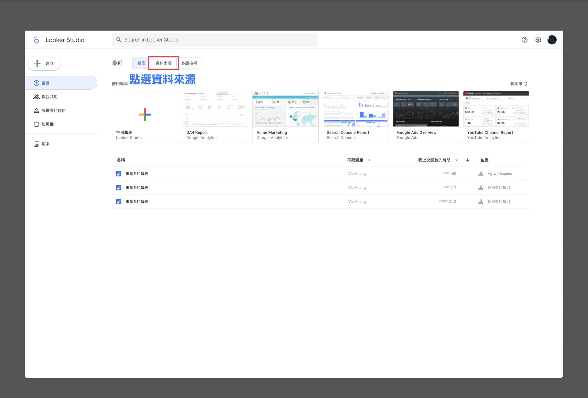

> 💡 **提示**：您可以看到各種範本報表，但我們需要先建立自己的資料來源

---

## 2. 建立資料來源

1. 在資料來源頁面，點擊「**+ 建立新資料來源**」按鈕

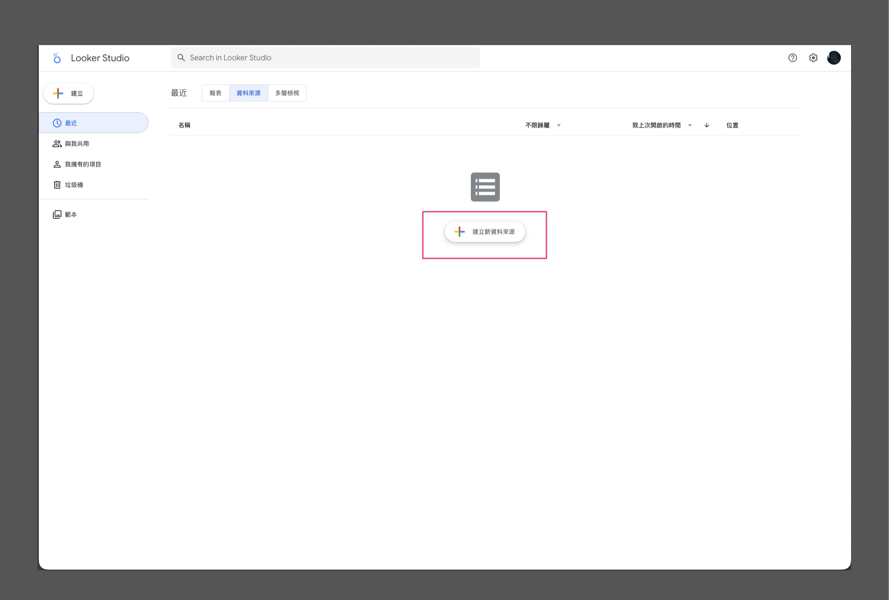

---

## 3. 選擇 BigQuery 連接器

1. 在 Google Connectors 列表中，找到並點選「**BigQuery**」

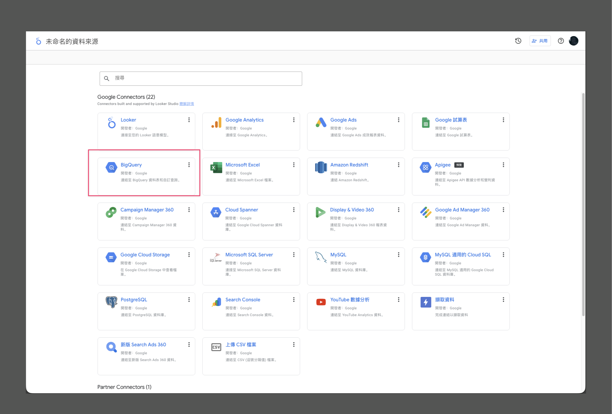

> 📌 BigQuery 是 Google 提供的企業級資料倉儲服務，我們的 ERP 資料都儲存在這裡

---

## 4. 選擇專案與資料集

### 4.1 選擇專案

1. 在左側「Project」下拉選單中，找到並選擇 **b25h01-ragic**

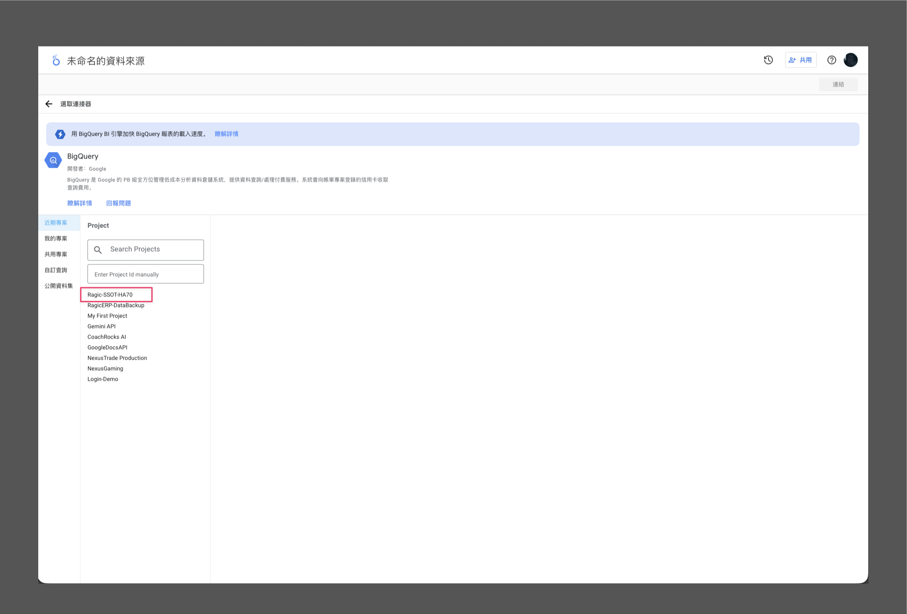

### 4.2 選擇資料集

1. 選擇專案後，右側會出現「資料集」下拉選單
2. 選擇 **erp_backup** 資料集

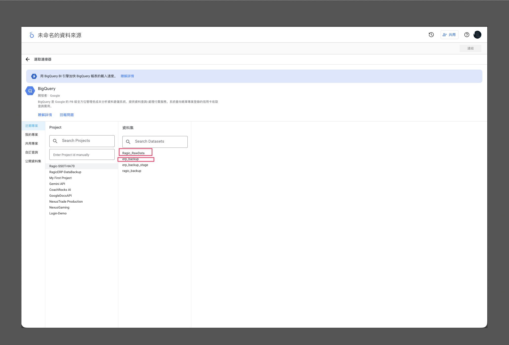

### 4.3 瀏覽可用資料表

1. 選擇資料集後，會顯示所有可用的資料表
2. 常用資料表包括：
   - `sheet_50_order` - 訂單資料
   - `sheet_60_customer` - 客戶資料  
   - `sheet_99_order_detail` - 訂單明細
   - `fact_orders` - 訂單事實表（已清洗）

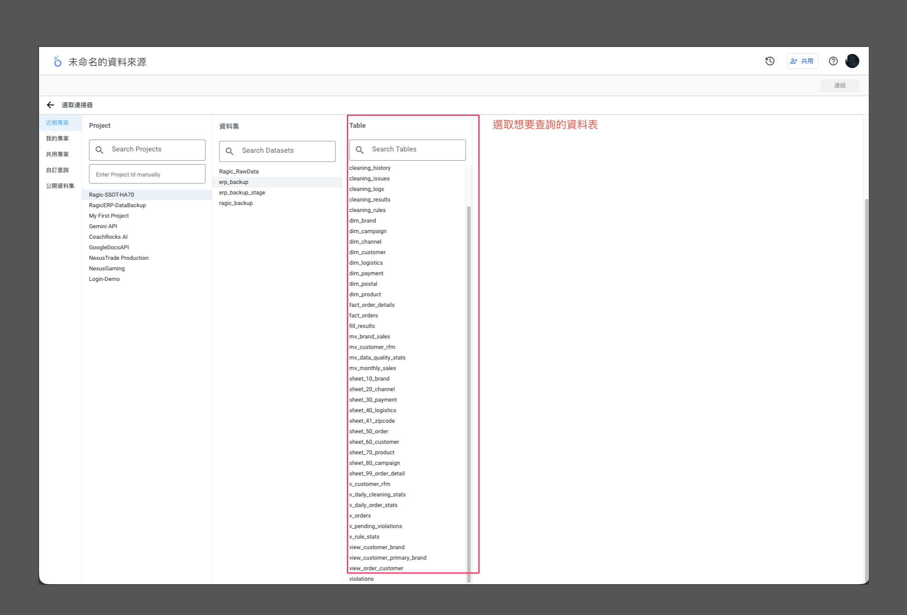

---

## 5. 選擇資料表

1. 在資料表列表中，點選您想要查詢的資料表
2. 例如：選擇 `sheet_99_order_detail`
3. 點擊右上角的「**連結**」按鈕

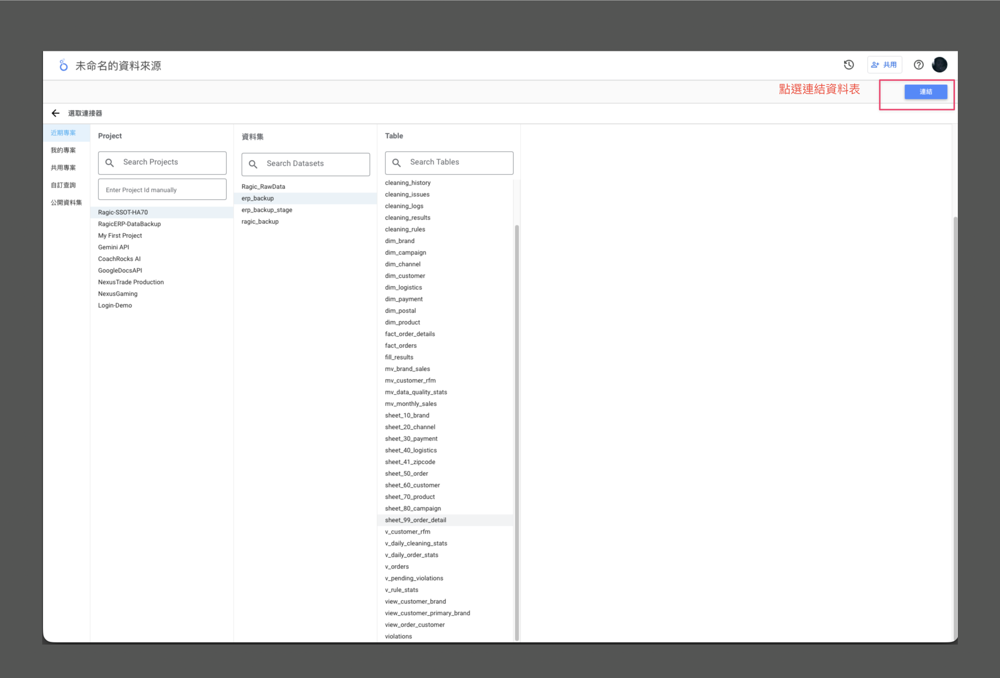

---

## 6. 確認欄位設定

連結資料表後，系統會顯示該表的所有欄位：

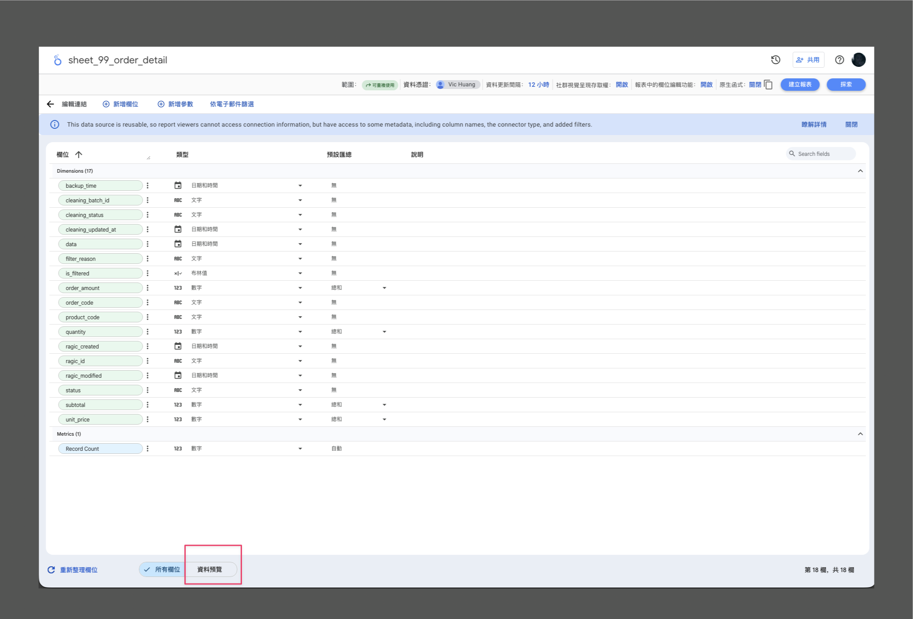

### 欄位資訊說明

| 欄位區塊 | 說明 |
|---------|------|
| **欄位** | 欄位名稱 |
| **類型** | 資料類型（文字/數字/日期時間） |
| **預設彙總** | 預設的計算方式（加總/計數等） |
| **說明** | 欄位描述 |

### 常見欄位類型

- `abc` - 文字類型
- `123` - 數字類型  
- `📅` - 日期時間類型

### 進入資料預覽

確認欄位設定後，點擊左下角的「**資料預覽**」按鈕進入下一步

> 📌 **注意**：「資料預覽」按鈕位於頁面左下角，點擊後可以預覽實際資料內容

---

## 7. 選擇顯示欄位

1. 在左側面板，您可以選擇想要顯示的欄位
2. 勾選需要的欄位項目
3. 可用欄位包括：
   - `ragic_id` - 記錄識別碼
   - `order_code` - 訂單編號
   - `product_code` - 商品編號
   - `quantity` - 數量
   - `subtotal` - 小計
   - 其他欄位...

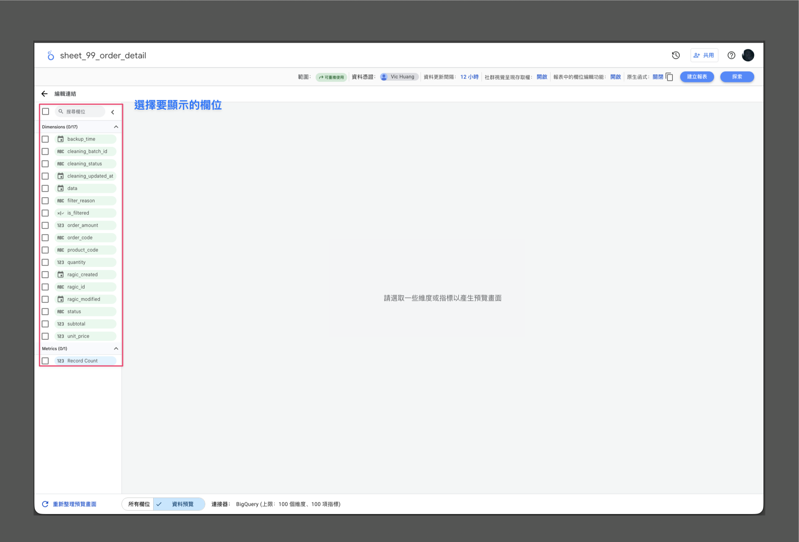

---

## 8. 資料預覽

1. 選擇欄位後，點擊「**重新整理預覽資料**」按鈕
2. 系統會顯示實際資料內容

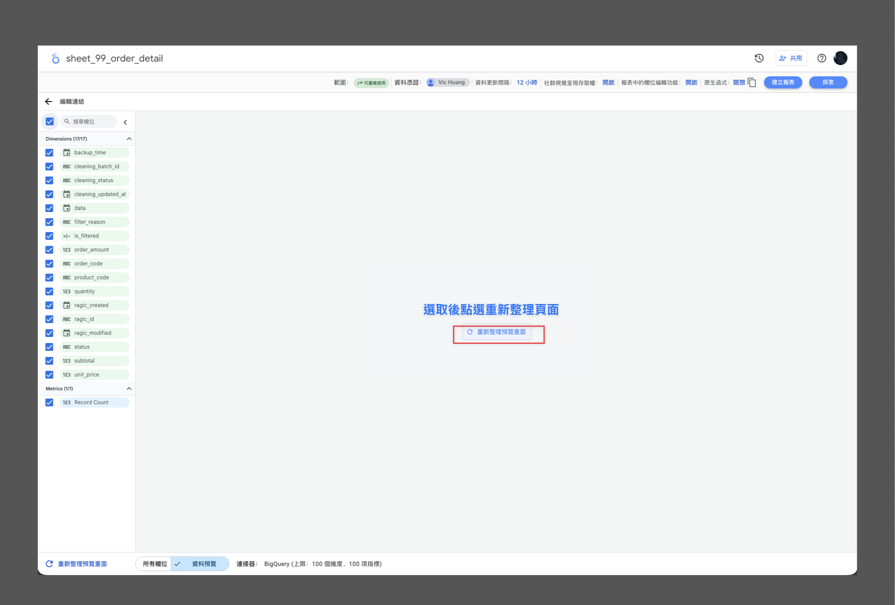

3. 預覽資料會以表格形式呈現

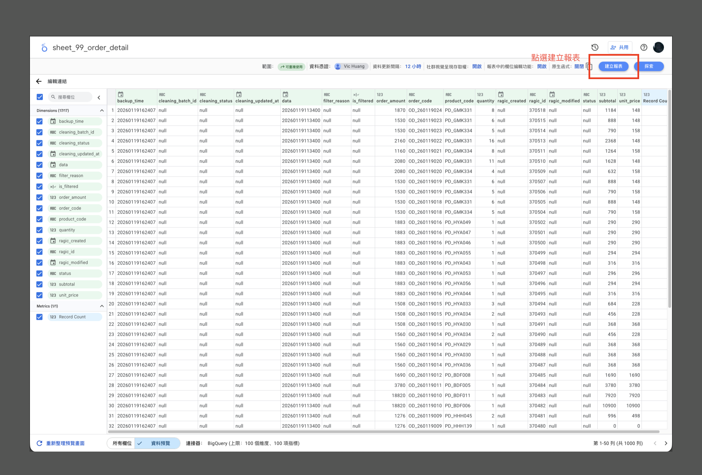

### 資料預覽說明

- 預設顯示前 100 筆資料
- 可捲動查看更多資料
- 確認資料正確後，可以建立報表

---

## 9. 建立報表

確認資料來源無誤後，您可以建立視覺化報表：

1. 點擊右上角的「**建立報表**」按鈕
2. 選擇報表格式（表格、圖表等）
3. 從右側面板拖曳欄位到報表區域

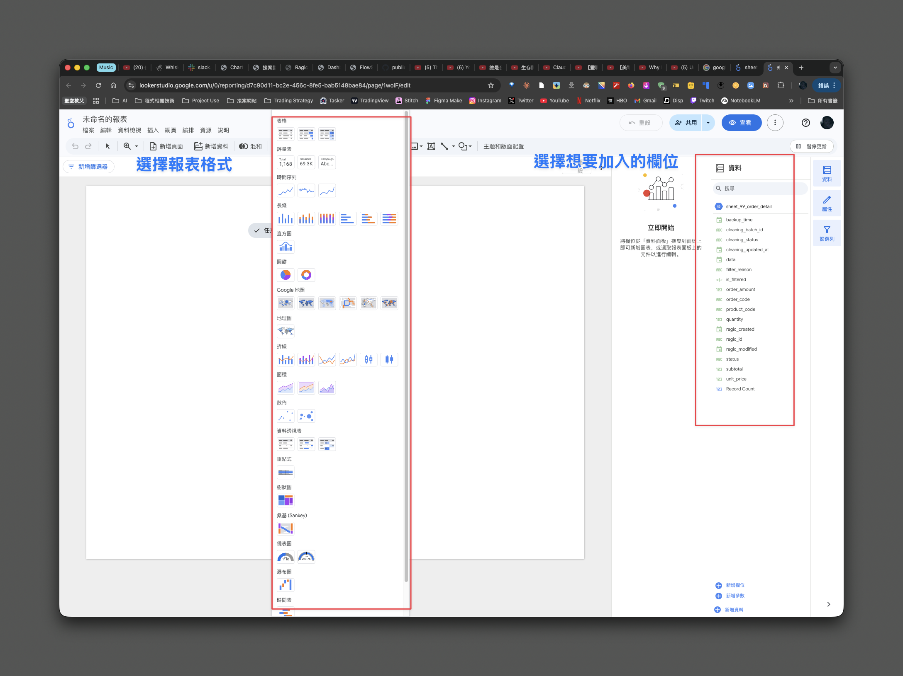

### 常用圖表類型

| 圖表類型 | 適用情境 |
|---------|---------|
| 📊 **表格** | 查看明細資料 |
| 📈 **折線圖** | 趨勢分析（如：每日訂單量） |
| 📊 **長條圖** | 比較分析（如：各品牌銷售額） |
| 🥧 **圓餅圖** | 佔比分析（如：通路佔比） |
| 🔢 **計分卡** | 單一指標（如：總訂單數） |

---

## 📋 常用資料表快速參考

| 資料表 | 說明 | 適用場景 |
|-------|------|---------|
| `sheet_50_order` | 原始訂單資料 | 查看完整訂單資訊 |
| `sheet_60_customer` | 原始客戶資料 | 客戶資訊查詢 |
| `sheet_99_order_detail` | 訂單明細 | 商品銷售分析 |
| `fact_orders` | 清洗後訂單事實表 | 訂單統計報表 |
| `dim_customer` | 客戶維度表 | 客戶分析 |
| `dim_product` | 商品維度表 | 商品分析 |

---

## ❓ 常見問題

### Q: 看不到 b25h01-ragic 專案？

請確認您的 Google 帳號已被授權存取此專案。如需權限，請聯絡管理員。

### Q: 資料表是空的？

1. 確認選擇正確的資料集（erp_backup）
2. 確認備份任務已正常執行
3. 部分資料表可能因清洗條件被過濾

### Q: 如何儲存報表？

1. 點擊右上角的「儲存」按鈕
2. 輸入報表名稱
3. 選擇儲存位置

---

**文件結束**

> 💡 如有任何問題，歡迎隨時聯絡技術支援！
