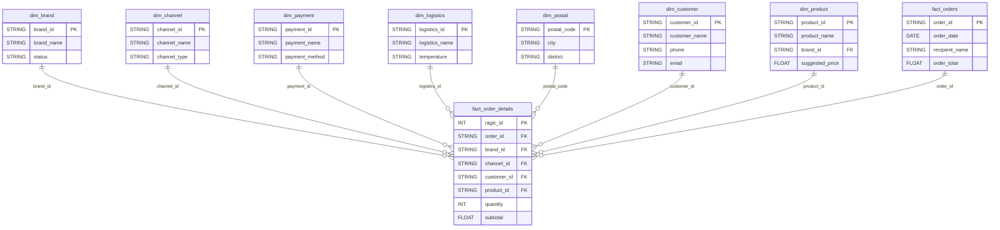

# RagicEDP 專案初步規劃書

**版本**: v1.2
**建立日期**: 2025-12-21
**更新日期**: 2025-12-21
**狀態**: 技術選型已確認

---

## 專案概述

RagicEDP（Ragic Extract, Data cleansing, Presentation）是一套整合式資料管理系統，包含三個核心模組：

1. **資料備份模組** - 從 Ragic 增量備份至 BigQuery
2. **資料清理模組** - AI 驅動的資料品質管理
3. **視覺化模組** - 動態星狀模型圖繪製

---

## 一、資料備份模組

### 1.1 目標

重新設計 RagicDataBackup 系統，實現：
- **每日增量備份**：僅抓取當日新增/修改的資料
- **按資料表備份**：9 個 Ragic 表格獨立備份
- **週報告機制**：每週發送備份與清理報告

### 1.2 架構設計

```
┌─────────────────────────────────────────────────────────────┐
│                    每日備份流程                              │
├─────────────────────────────────────────────────────────────┤
│                                                             │
│  [Ragic API] ──增量抓取──▶ [資料轉換] ──▶ [BigQuery]        │
│       ↓                        ↓                            │
│  每日排程觸發              啟動資料清理                      │
│  (Cloud Scheduler)                                          │
│                                                             │
│  ┌─────────────────────────────────────────────────────┐   │
│  │ 週報告流程（每週日 00:00）                           │   │
│  ├─────────────────────────────────────────────────────┤   │
│  │ [BigQuery] ──統計分析──▶ [報告生成] ──▶ [Email]     │   │
│  └─────────────────────────────────────────────────────┘   │
│                                                             │
└─────────────────────────────────────────────────────────────┘
```

### 1.3 資料表對應

| Sheet | Ragic 表格 | BigQuery 表格 | 預估記錄數 | 角色 |
|-------|-----------|---------------|-----------|------|
| 10 | 品牌表 | dim_brand | 7 | 維度表 |
| 20 | 通路表 | dim_channel | 407 | 維度表 |
| 30 | 金流表 | dim_payment | 8 | 維度表 |
| 40 | 物流表 | dim_logistics | 32 | 維度表 |
| 41 | 郵遞區號表 | dim_postal | 369 | 維度表 |
| 60 | 客戶表 | dim_customer | ~61,500 | 維度表 |
| 70 | 商品表 | dim_product | ~1,300 | 維度表 |
| 80 | 活動管理表 | dim_campaign | 42 | 維度表 |
| 50 | 訂單表 | fact_orders | ~88,000 | 事實表 |
| 99 | 訂單明細表 | fact_order_details | ~310,000 | 事實表 |

### 1.4 增量備份策略

```python
# 增量備份邏輯
def incremental_backup(sheet_code: str):
    """
    1. 查詢 BigQuery 該表最後更新時間 (last_modified_date)
    2. 從 Ragic API 抓取 last_modified_date > last_backup_time 的記錄
    3. UPSERT 到 BigQuery（使用 MERGE）
    4. 更新 backup_metadata 表
    """
```

**每日增量預估**：
- 總資料量：~460,000 筆
- 週增量比例：2.1%
- 日增量：約 1,400 筆

### 1.5 週報告內容

| 報告項目 | 說明 |
|---------|------|
| 備份統計 | 各表新增/更新/刪除筆數 |
| 資料品質 | 異常記錄數量、類型分布 |
| 執行狀態 | 成功/失敗次數、錯誤訊息 |
| 趨勢分析 | 資料成長趨勢、異常趨勢 |

---

## 二、資料清理模組

### 2.1 目標

建立 AI 驅動的資料品質管理系統：
- **自動檢測**：SQL + AI 雙層過濾
- **智慧學習**：從歷史資料學習正常模式
- **規則擴展**：支援手動新增檢測規則

### 2.2 四層檢測架構

```
┌─────────────────────────────────────────────────────────────┐
│                    資料異常檢測系統                          │
├─────────────────────────────────────────────────────────────┤
│                                                             │
│  Layer 1: 統計異常檢測（單欄位）                            │
│  ├── Z-Score / IQR 離群值檢測                              │
│  ├── 分布異常（直方圖偏移）                                │
│  └── 空值/格式異常                                         │
│                                                             │
│  Layer 2: 關聯規則學習（多欄位）                            │
│  ├── 歷史關聯挖掘：品牌 ↔ 促銷專案                        │
│  ├── 組合頻率分析：哪些組合從未出現過                      │
│  └── 異常組合標記：首次出現的組合                          │
│                                                             │
│  Layer 3: 時序異常檢測                                      │
│  ├── 趨勢突變（單一客戶消費異常）                          │
│  └── 週期異常（淡旺季偏離）                                │
│                                                             │
│  Layer 4: 外鍵完整性檢測                                    │
│  └── 參照不存在（孤立記錄）                                │
│                                                             │
└─────────────────────────────────────────────────────────────┘
```

### 2.3 檢測類別清單

#### A. 實體歸屬類（關聯規則學習）

| 代碼 | 欄位對 | 錯誤描述 | 嚴重性 |
|------|--------|---------|--------|
| A1 | brand_id ↔ promotion_id | 促銷不屬於品牌 | 高 |
| A2 | brand_id ↔ product_id | 商品不屬於品牌 | 高 |
| A3 | brand_id ↔ channel_id | 品牌不在此通路銷售 | 中 |
| A4 | channel_id ↔ payment_method_id | 通路不支援此金流 | 中 |
| A5 | channel_id ↔ logistics_id | 通路不使用此物流 | 中 |

#### B. 數值合理性類（統計檢測）

| 代碼 | 欄位 | 錯誤描述 | 方法 |
|------|------|---------|------|
| B1 | net_revenue | 負數或超大金額 | IQR |
| B2 | quantity | 負數或零 | 範圍檢查 |
| B3 | product_msrp | 建議售價異常 | IQR |
| B4 | gross_revenue vs net_revenue | 含運實收 < 訂單實收 | 邏輯檢查 |

#### C. 時間邏輯類

| 代碼 | 欄位對 | 錯誤描述 |
|------|--------|---------|
| C1 | created_at vs last_modified_date | 建檔日期 > 修改日期 |
| C2 | order_date vs requested_delivery_date | 訂單日期 > 希望到貨日 |
| C3 | birthday | 生日在未來 / 年齡 > 120 |

#### D. 參照完整性類

| 代碼 | 欄位 | 參照表 |
|------|------|--------|
| D1 | brand_id | dim_brand |
| D2 | channel_id | dim_channel |
| D3 | customer_id | dim_customer |
| D4 | product_id | dim_product |

#### E. 格式一致性類

| 代碼 | 欄位 | 錯誤描述 | 正則表達式 |
|------|------|---------|-----------|
| F1 | mobile_phone | 電話格式不正確 | `^09\d{8}$` |
| F2 | email | Email 格式不正確 | 標準 Email regex |
| F3 | tax_id | 統一編號格式錯誤 | `^\d{8}$` |

### 2.4 處理流程

```
┌─────────────────────────────────────────────────────────────┐
│                    資料清理流程                              │
├─────────────────────────────────────────────────────────────┤
│                                                             │
│  Step 1: SQL 快速過濾（BigQuery 側）                        │
│  ├── 外鍵完整性檢查                                        │
│  ├── 數值範圍檢查                                          │
│  ├── 關聯矩陣比對                                          │
│  └── 輸出：候選異常（約 100-500 筆/週）                    │
│                                                             │
│  Step 2: AI 深度分析（候選資料）                            │
│  ├── 語義分析：地址、備註合理性                            │
│  ├── 上下文判斷：異常嚴重性評估                            │
│  ├── 修正建議：AI 提供可能正確值                           │
│  └── 信心度評分：高/中/低                                  │
│                                                             │
│  Step 3: 人工審核                                           │
│  ├── 高信心度：自動修正（需人工確認）                      │
│  ├── 中信心度：提供選項供人工選擇                          │
│  └── 低信心度：標記待查                                    │
│                                                             │
│  Step 4: 回饋學習                                           │
│  ├── 人工審核結果 → 更新學習模型                          │
│  └── 新增規則 → 規則庫更新                                │
│                                                             │
└─────────────────────────────────────────────────────────────┘
```

### 2.5 AI 學習機制

```python
class AnomalyLearner:
    """AI 異常學習模組"""

    def __init__(self):
        self.association_rules = {}  # 關聯規則庫
        self.custom_rules = []       # 手動規則庫
        self.feedback_history = []   # 人工反饋歷史

    def learn_associations(self, historical_data):
        """從歷史資料學習正常關聯模式"""
        # 例：品牌 A 通常搭配促銷 1、2、3
        pass

    def add_custom_rule(self, rule_config):
        """手動新增檢測規則"""
        # 例：金額 > 100萬 且 客戶等級 = 一般 → 異常
        pass

    def update_from_feedback(self, feedback):
        """根據人工審核結果更新模型"""
        # 例：品牌 A + 促銷 99 被確認為合法 → 加入白名單
        pass
```

### 2.6 資料表設計

```sql
-- 異常記錄表
CREATE TABLE data_anomalies (
    anomaly_id STRING,           -- 異常 ID
    source_table STRING,         -- 來源表
    source_id STRING,            -- 原始記錄 ID
    anomaly_type STRING,         -- 異常類型 (A1, B2, C1...)
    anomaly_description STRING,  -- 異常描述
    original_value STRING,       -- 原始值
    suggested_value STRING,      -- AI 建議值
    confidence_score FLOAT64,    -- 信心度 (0-1)
    status STRING,               -- pending/approved/rejected/fixed
    detected_at TIMESTAMP,       -- 檢測時間
    reviewed_at TIMESTAMP,       -- 審核時間
    reviewed_by STRING           -- 審核人
);

-- 學習規則表
CREATE TABLE learned_associations (
    field_pair STRING,           -- 欄位對 (brand_id:promotion_id)
    value_a STRING,              -- 值 A
    value_b STRING,              -- 值 B
    occurrence_count INT64,      -- 出現次數
    first_seen TIMESTAMP,        -- 首次出現
    last_seen TIMESTAMP,         -- 最後出現
    is_whitelisted BOOL          -- 白名單標記
);

-- 自定義規則表
CREATE TABLE custom_rules (
    rule_id STRING,
    rule_name STRING,
    rule_condition STRING,       -- SQL 條件
    severity STRING,             -- high/medium/low
    is_active BOOL,
    created_at TIMESTAMP,
    created_by STRING
);
```

---

## 三、動態星狀模型視覺化

### 3.1 目標

建立動態星狀模型圖繪製系統：
- **自動生成**：從 BigQuery Schema 自動生成 Mermaid 圖
- **多層次展示**：總覽圖 / 詳細圖 / 資料流圖
- **即時更新**：Schema 變更時自動更新圖表

### 3.2 星狀模型結構



### 3.3 視覺化層次

| 層次 | 用途 | 內容 |
|------|------|------|
| Level 1 總覽 | 管理層報告 | 表名 + 關聯線 |
| Level 2 詳細 | 技術開發 | 完整欄位 + 型別 |
| Level 3 資料流 | 資料工程 | ETL 流程圖 |

### 3.4 動態生成功能

```python
class StarSchemaGenerator:
    """星狀模型圖生成器"""

    def __init__(self, bq_client, dataset_id):
        self.bq_client = bq_client
        self.dataset_id = dataset_id

    def fetch_schema(self) -> dict:
        """從 BigQuery 抓取 Schema"""
        pass

    def detect_relationships(self) -> list:
        """自動偵測外鍵關聯"""
        pass

    def generate_mermaid(self, level: str = "overview") -> str:
        """生成 Mermaid 程式碼"""
        pass

    def export_html(self, output_path: str):
        """匯出互動式 HTML"""
        pass
```

---

## 四、環境配置（已確認）

### 4.1 Ragic API 配置

從 `/Users/gamepig/projects/RagicDataBackup/.env.complete.yaml` 繼承：

| 項目 | 值 |
|------|-----|
| 帳號 | grefun |
| 伺服器 | ap6.ragic.com |
| 每頁筆數 | 1000 |
| 最大頁數 | 50 |
| 增量欄位 | _ragicModified, 最後修改日期 |

### 4.2 BigQuery 配置

| 項目 | 值 |
|------|-----|
| 專案 ID | b25h01-ragic |
| Dataset | erp_backup |
| 區域 | asia-east1 |

### 4.3 Email 配置

| 項目 | 值 |
|------|-----|
| SMTP 發送者 | gcp.ops.notifications@gmail.com |
| 通知收件者 | it.ps@grefun.com.tw |

### 4.4 Sheet 對應表

| Sheet Code | Ragic Path | 表格名稱 |
|------------|-----------|---------|
| 10 | forms8/5 | 品牌表 |
| 20 | forms8/4 | 通路表 |
| 30 | forms8/7 | 金流表 |
| 40 | forms8/1 | 物流表 |
| 41 | forms8/6 | 郵遞區號表 |
| 50 | forms8/17 | 訂單表 |
| 60 | forms8/2 | 客戶表 |
| 70 | forms8/9 | 商品表 |
| 80 | forms8/10 | 活動管理表 |
| 99 | forms8/3 | 訂單明細表 |

---

## 五、技術架構

### 5.1 系統架構圖

```
┌─────────────────────────────────────────────────────────────┐
│                       RagicEDP 系統                          │
├─────────────────────────────────────────────────────────────┤
│                                                             │
│  ┌─────────────┐    ┌─────────────┐    ┌─────────────┐     │
│  │   Ragic     │───▶│  備份模組   │───▶│  BigQuery   │     │
│  │   API       │    │ (Cloud Run) │    │             │     │
│  └─────────────┘    └─────────────┘    └──────┬──────┘     │
│                                               │             │
│                           ┌───────────────────┘             │
│                           ▼                                 │
│                    ┌─────────────┐                          │
│                    │  清理模組   │                          │
│                    │ (Cloud Run) │                          │
│                    └──────┬──────┘                          │
│                           │                                 │
│              ┌────────────┼────────────┐                    │
│              ▼            ▼            ▼                    │
│       ┌──────────┐ ┌──────────┐ ┌──────────┐               │
│       │ SQL 檢測 │ │ AI 分析  │ │ 規則引擎 │               │
│       └──────────┘ └──────────┘ └──────────┘               │
│                           │                                 │
│                           ▼                                 │
│                    ┌─────────────┐                          │
│                    │  視覺化模組 │                          │
│                    └──────┬──────┘                          │
│                           │                                 │
│              ┌────────────┼────────────┐                    │
│              ▼            ▼            ▼                    │
│       ┌──────────┐ ┌──────────┐ ┌──────────┐               │
│       │ Mermaid  │ │ 週報告   │ │ Email    │               │
│       │ 圖表     │ │ 生成     │ │ 通知     │               │
│       └──────────┘ └──────────┘ └──────────┘               │
│                                                             │
└─────────────────────────────────────────────────────────────┘
```

### 5.2 技術選型

| 組件 | 技術選擇 | 說明 |
|------|---------|------|
| 執行環境 | Google Cloud Run | 無伺服器、按需擴展 |
| 排程 | Cloud Scheduler | 每日/每週觸發 |
| 資料庫 | BigQuery | 資料倉儲 |
| AI 引擎（主要） | **OpenRouter** | 支援多模型切換 |
| AI 引擎（備援） | OpenAI | 當 OpenRouter 不可用時自動切換 |
| 圖表 | Mermaid | 版控友善、Markdown 整合 |
| 通知 | **Email + LINE** | 週報 Email、審核通知 LINE |
| 審核介面 | Vue 3 + **Element Plus** | 人工審核操作 |
| 報表 | Looker Studio | 儀表板與趨勢分析 |
| 認證 | **Google OAuth 2.0** + 本地帳密 | 雙重認證機制 |

### 5.3 AI 引擎設計（OpenRouter 主要 + OpenAI 備援）

#### 配置結構

```yaml
# config/ai.yaml
ai:
  primary:
    provider: openrouter
    api_key: ${OPENROUTER_API_KEY}
    model: anthropic/claude-3.5-sonnet  # 預設模型
    available_models:
      - anthropic/claude-3.5-sonnet
      - anthropic/claude-3-haiku
      - google/gemini-pro
      - openai/gpt-4-turbo
      - meta-llama/llama-3-70b

  fallback:
    provider: openai
    api_key: ${OPENAI_API_KEY}
    model: gpt-4-turbo
    available_models:
      - gpt-4-turbo
      - gpt-4
      - gpt-3.5-turbo

  settings:
    timeout: 30
    max_retries: 3
    fallback_on_error: true
```

#### 實現程式碼

```python
from abc import ABC, abstractmethod
from typing import Optional
import httpx
import logging

class AIProvider(ABC):
    """AI Provider 抽象介面"""

    def __init__(self, api_key: str, model: str):
        self.api_key = api_key
        self.model = model
        self.available_models: list = []

    @abstractmethod
    def analyze(self, prompt: str, data: dict) -> dict:
        pass

    def switch_model(self, model: str):
        """動態切換模型"""
        if model in self.available_models:
            self.model = model
            logging.info(f"Switched to model: {model}")
        else:
            raise ValueError(f"Model {model} not available")


class OpenRouterProvider(AIProvider):
    """OpenRouter 實現（主要）"""

    BASE_URL = "https://openrouter.ai/api/v1/chat/completions"

    def __init__(self, api_key: str, model: str = "anthropic/claude-3.5-sonnet"):
        super().__init__(api_key, model)
        self.available_models = [
            "anthropic/claude-3.5-sonnet",
            "anthropic/claude-3-haiku",
            "google/gemini-pro",
            "openai/gpt-4-turbo",
        ]

    def analyze(self, prompt: str, data: dict) -> dict:
        headers = {
            "Authorization": f"Bearer {self.api_key}",
            "Content-Type": "application/json",
        }
        payload = {
            "model": self.model,
            "messages": [{"role": "user", "content": f"{prompt}\n{json.dumps(data)}"}]
        }

        response = httpx.post(self.BASE_URL, headers=headers, json=payload, timeout=30)
        response.raise_for_status()
        return json.loads(response.json()["choices"][0]["message"]["content"])


class OpenAIProvider(AIProvider):
    """OpenAI 實現（備援）"""

    def __init__(self, api_key: str, model: str = "gpt-4-turbo"):
        super().__init__(api_key, model)
        self.client = OpenAI(api_key=api_key)
        self.available_models = ["gpt-4-turbo", "gpt-4", "gpt-3.5-turbo"]

    def analyze(self, prompt: str, data: dict) -> dict:
        response = self.client.chat.completions.create(
            model=self.model,
            messages=[{"role": "user", "content": f"{prompt}\n{json.dumps(data)}"}]
        )
        return json.loads(response.choices[0].message.content)


class AIService:
    """AI 服務（帶備援機制）"""

    def __init__(self, config: dict):
        self.primary = OpenRouterProvider(
            config["primary"]["api_key"],
            config["primary"]["model"]
        )
        self.fallback = OpenAIProvider(
            config["fallback"]["api_key"],
            config["fallback"]["model"]
        )
        self.use_fallback = config["settings"].get("fallback_on_error", True)

    def analyze(self, prompt: str, data: dict) -> dict:
        """分析資料，失敗時自動切換備援"""
        try:
            return self.primary.analyze(prompt, data)
        except Exception as e:
            logging.warning(f"Primary AI failed: {e}")
            if self.use_fallback:
                logging.info("Switching to fallback AI (OpenAI)")
                return self.fallback.analyze(prompt, data)
            raise

    def switch_model(self, provider: str, model: str):
        """切換指定 Provider 的模型"""
        if provider == "primary":
            self.primary.switch_model(model)
        elif provider == "fallback":
            self.fallback.switch_model(model)
```

### 5.4 專案結構

```
RagicEDP/
├── documents/                     # 文件
│   └── RagicEDP_初步規劃書.md
├── src/
│   ├── backup/                    # 備份模組
│   │   ├── ragic_client.py       # Ragic API 客戶端
│   │   ├── bigquery_uploader.py  # BigQuery 上傳
│   │   └── scheduler.py          # 排程管理
│   ├── cleaning/                  # 清理模組
│   │   ├── anomaly_detector.py   # 異常檢測器
│   │   ├── ai_analyzer.py        # AI 分析器
│   │   ├── rule_engine.py        # 規則引擎
│   │   └── learner.py            # 學習模組
│   ├── visualization/             # 視覺化模組
│   │   ├── schema_fetcher.py     # Schema 抓取
│   │   ├── mermaid_generator.py  # Mermaid 生成
│   │   └── html_exporter.py      # HTML 匯出
│   └── reporting/                 # 報告模組
│       ├── report_generator.py   # 報告生成
│       └── email_sender.py       # Email 發送
├── sql/                           # SQL 腳本
│   ├── create_tables.sql         # 建表語句
│   ├── anomaly_detection.sql     # 異常檢測 SQL
│   └── weekly_report.sql         # 週報告查詢
├── config/                        # 配置
│   ├── sheets.yaml               # 資料表配置
│   ├── rules.yaml                # 檢測規則配置
│   └── email.yaml                # Email 配置
└── tests/                         # 測試
```

---

## 六、人工審核介面設計

### 6.1 GCP 原生選項評估

| 工具 | 優點 | 缺點 | 建議 |
|------|------|------|------|
| **Looker Studio** | 免費、原生整合 BigQuery、報表功能強 | 無法直接修改資料、互動性有限 | 用於報表展示 |
| **Dataplex Data Quality** | 原生資料品質掃描、自動化 | 無人工審核介面 | 用於自動檢測 |
| **BigQuery Console** | 可直接執行 SQL、查看資料 | 非友善的審核 UI | 僅供開發使用 |
| **Data Quality Monitor (DQM)** | 開源、有 Web 管理介面 | 需自行部署維護 | 備選方案 |

### 6.2 建議方案：自建 SPA + Looker Studio 組合

```
┌─────────────────────────────────────────────────────────────┐
│                    審核介面架構                              │
├─────────────────────────────────────────────────────────────┤
│                                                             │
│  ┌─────────────────────────────────────────────────────┐   │
│  │ Looker Studio（報表層）                              │   │
│  │ - 異常統計儀表板                                    │   │
│  │ - 趨勢分析圖表                                      │   │
│  │ - 週報告自動生成                                    │   │
│  └─────────────────────────────────────────────────────┘   │
│                                                             │
│  ┌─────────────────────────────────────────────────────┐   │
│  │ 自建 SPA（審核操作層）                               │   │
│  │ - 異常記錄列表                                      │   │
│  │ - 逐筆審核功能（通過/拒絕/修正）                    │   │
│  │ - AI 建議預覽                                       │   │
│  │ - 批次操作                                          │   │
│  │ - 規則管理介面                                      │   │
│  └─────────────────────────────────────────────────────┘   │
│                                                             │
└─────────────────────────────────────────────────────────────┘
```

### 6.3 SPA 技術選型（已確認）

| 項目 | 選擇 | 說明 |
|------|------|------|
| 框架 | Vue 3 + Vite | 輕量、快速開發 |
| UI 庫 | **Element Plus** | 企業級組件、表格功能強 |
| 後端 | Cloud Run + Python FastAPI | 無伺服器、BigQuery 整合 |
| 認證 | **Google OAuth 2.0 + 本地帳密** | 雙重認證機制 |
| 部署 | Firebase Hosting | 免費、CDN |

### 6.4 認證與權限機制

#### 認證流程

```
┌─────────────────────────────────────────────────────────────┐
│                    認證流程                                  │
├─────────────────────────────────────────────────────────────┤
│                                                             │
│  ┌─────────────────────────────────────────────────────┐   │
│  │ 方式一：Google OAuth 2.0（推薦）                     │   │
│  │ 1. 點擊「使用 Google 登入」                         │   │
│  │ 2. Google 認證頁面                                  │   │
│  │ 3. 返回 callback，取得 ID Token                     │   │
│  │ 4. 後端驗證 Token，檢查 Email 是否在白名單          │   │
│  │ 5. 發放 JWT Session Token                          │   │
│  └─────────────────────────────────────────────────────┘   │
│                                                             │
│  ┌─────────────────────────────────────────────────────┐   │
│  │ 方式二：本地帳號密碼（備選）                         │   │
│  │ 1. 輸入帳號密碼                                     │   │
│  │ 2. 後端驗證（bcrypt hash）                          │   │
│  │ 3. 發放 JWT Session Token                          │   │
│  └─────────────────────────────────────────────────────┘   │
│                                                             │
└─────────────────────────────────────────────────────────────┘
```

#### 使用者角色

| 角色 | 權限 |
|------|------|
| **admin** | 全部權限：審核、規則管理、使用者管理 |
| **reviewer** | 審核權限：查看、審核異常記錄 |
| **viewer** | 唯讀權限：查看報表和儀表板 |

#### 使用者管理資料表

```sql
-- 使用者表
CREATE TABLE users (
    user_id STRING,
    email STRING,                    -- Google 或本地帳號
    password_hash STRING,            -- 本地帳號密碼 (bcrypt)
    auth_provider STRING,            -- google / local
    display_name STRING,
    role STRING,                     -- admin / reviewer / viewer
    is_active BOOL,
    created_at TIMESTAMP,
    last_login_at TIMESTAMP
);

-- 登入記錄
CREATE TABLE login_logs (
    log_id STRING,
    user_id STRING,
    login_at TIMESTAMP,
    ip_address STRING,
    user_agent STRING,
    success BOOL
);
```

### 6.5 通知機制（Email + LINE）

#### 通知場景

| 場景 | 通知方式 | 說明 |
|------|---------|------|
| 週報 | **Email** | 每週日發送完整報告 |
| 需人工審核 | **LINE + Email** | 發現高優先異常時即時通知 |
| 審核完成 | Email | 審核結果回報 |
| 系統錯誤 | LINE | 備份/清理失敗告警 |

#### LINE Notify 整合

```python
import requests

class LineNotifier:
    """LINE Notify 通知服務"""

    NOTIFY_URL = "https://notify-api.line.me/api/notify"

    def __init__(self, token: str):
        self.token = token
        self.headers = {"Authorization": f"Bearer {token}"}

    def send(self, message: str, sticker_id: int = None) -> bool:
        """
        發送 LINE 通知

        Args:
            message: 通知內容（最多 1000 字）
            sticker_id: 可選貼圖

        Returns:
            是否成功
        """
        data = {"message": message}
        if sticker_id:
            data["stickerPackageId"] = 1
            data["stickerId"] = sticker_id

        response = requests.post(
            self.NOTIFY_URL,
            headers=self.headers,
            data=data
        )
        return response.status_code == 200

    def send_review_alert(self, anomaly_count: int, high_priority: int):
        """發送審核提醒"""
        message = f"""
🔔 資料異常審核提醒

📊 待審核記錄：{anomaly_count} 筆
⚠️ 高優先級：{high_priority} 筆

請登入系統進行審核：
https://your-app.web.app/review
        """
        return self.send(message)
```

#### 通知服務整合

```python
class NotificationService:
    """統一通知服務"""

    def __init__(self, config: dict):
        self.email = EmailSender(config["email"])
        self.line = LineNotifier(config["line"]["token"])

    def notify_review_needed(self, anomaly_summary: dict):
        """通知需要人工審核"""
        # LINE 即時通知
        self.line.send_review_alert(
            anomaly_summary["total"],
            anomaly_summary["high_priority"]
        )

        # Email 詳細通知
        self.email.send(
            to=config["reviewers"],
            subject="[RagicEDP] 資料異常需審核",
            body=self._build_review_email(anomaly_summary)
        )

    def send_weekly_report(self, report_data: dict):
        """發送週報（僅 Email）"""
        self.email.send(
            to=config["report_recipients"],
            subject=f"[RagicEDP] 週報 {report_data['week']}",
            body=self._build_weekly_report(report_data),
            attachments=[report_data["pdf_path"]]
        )

    def alert_system_error(self, error: str):
        """系統錯誤告警（LINE）"""
        self.line.send(f"🚨 系統錯誤\n\n{error}")
```

#### 配置結構

```yaml
# config/notification.yaml
notification:
  email:
    smtp_host: smtp.gmail.com
    smtp_port: 587
    from_email: ${SMTP_FROM_EMAIL}
    password: ${SMTP_PASSWORD}

  line:
    token: ${LINE_NOTIFY_TOKEN}

  recipients:
    reviewers:
      - it.ps@grefun.com.tw
    report:
      - it.ps@grefun.com.tw

  rules:
    review_threshold: 10           # 累積超過 N 筆才發通知
    high_priority_immediate: true  # 高優先級立即通知
```

### 6.6 SPA 核心功能

```
┌─────────────────────────────────────────────────────────────┐
│                 異常審核 SPA 功能模組                        │
├─────────────────────────────────────────────────────────────┤
│                                                             │
│  1. 待審核列表                                              │
│     ├── 篩選：異常類型、嚴重性、日期範圍                   │
│     ├── 排序：信心度、建立時間                             │
│     └── 分頁：支援大量資料                                 │
│                                                             │
│  2. 詳細審核頁                                              │
│     ├── 原始資料展示                                       │
│     ├── AI 分析結果                                        │
│     ├── 修正建議（可編輯）                                 │
│     └── 操作按鈕：通過/拒絕/修正/跳過                      │
│                                                             │
│  3. 批次操作                                                │
│     ├── 批次通過高信心度項目                               │
│     ├── 批次標記為待查                                     │
│     └── 匯出審核結果                                       │
│                                                             │
│  4. 規則管理                                                │
│     ├── 新增自定義規則                                     │
│     ├── 編輯/停用規則                                      │
│     ├── 規則測試                                           │
│     └── 白名單管理                                         │
│                                                             │
│  5. 儀表板（嵌入 Looker Studio）                            │
│     ├── 異常趨勢圖                                         │
│     ├── 類型分布餅圖                                       │
│     └── 審核進度追蹤                                       │
│                                                             │
└─────────────────────────────────────────────────────────────┘
```

---

## 七、多規則衝突處理策略

### 7.1 衝突類型

| 衝突類型 | 範例 | 說明 |
|---------|------|------|
| **矛盾判定** | 規則 A: 異常 vs 規則 B: 正常 | 同一記錄被不同規則判定相反 |
| **重複標記** | 規則 A + B 都標記為異常 | 同一問題被多規則重複報告 |
| **優先順序** | SQL 規則 vs AI 判斷 | 不同來源的結論不一致 |
| **嚴重性衝突** | 規則 A: 高 vs 規則 B: 低 | 同一異常被標記不同嚴重性 |

### 7.2 建議處理策略

#### 策略一：優先順序權重（推薦）

```python
# 規則優先順序定義
RULE_PRIORITY = {
    # Layer 4: 外鍵完整性（最高優先）
    'D1': 100,  # 品牌不存在
    'D2': 100,  # 通路不存在
    'D3': 100,  # 客戶不存在

    # Layer 1: 統計異常
    'B1': 80,   # 金額異常
    'B2': 80,   # 數量異常

    # Layer 2: 關聯規則
    'A1': 70,   # 品牌-促銷不匹配
    'A2': 70,   # 品牌-商品不匹配

    # Layer 3: 時序異常
    'C1': 60,   # 日期邏輯錯誤

    # 格式異常（最低優先）
    'F1': 40,   # 電話格式
    'F2': 40,   # Email 格式
}

def resolve_conflicts(anomalies: list) -> list:
    """
    解決規則衝突

    策略：
    1. 相同記錄多異常 → 保留最高優先的
    2. 矛盾判定 → 優先信任高優先規則
    3. 重複標記 → 合併為一條，列出所有觸發規則
    """
    # 按記錄 ID 分組
    grouped = defaultdict(list)
    for a in anomalies:
        grouped[a['source_id']].append(a)

    resolved = []
    for source_id, group in grouped.items():
        if len(group) == 1:
            resolved.append(group[0])
        else:
            # 按優先順序排序
            sorted_group = sorted(
                group,
                key=lambda x: RULE_PRIORITY.get(x['anomaly_type'], 50),
                reverse=True
            )
            # 保留最高優先，但記錄所有觸發規則
            primary = sorted_group[0]
            primary['all_triggered_rules'] = [a['anomaly_type'] for a in group]
            resolved.append(primary)

    return resolved
```

#### 策略二：嚴重性提升

```python
# 多規則觸發 → 提升嚴重性
SEVERITY_LEVELS = {'low': 1, 'medium': 2, 'high': 3, 'critical': 4}

def escalate_severity(anomaly: dict, triggered_count: int) -> str:
    """
    根據觸發規則數量提升嚴重性

    - 1 條規則：維持原嚴重性
    - 2-3 條規則：提升一級
    - 4+ 條規則：標記為 critical
    """
    base_severity = anomaly.get('severity', 'medium')
    base_level = SEVERITY_LEVELS.get(base_severity, 2)

    if triggered_count >= 4:
        return 'critical'
    elif triggered_count >= 2:
        new_level = min(base_level + 1, 3)
        return {v: k for k, v in SEVERITY_LEVELS.items()}[new_level]
    return base_severity
```

#### 策略三：白名單優先

```python
def apply_whitelist(anomaly: dict, whitelist: set) -> bool:
    """
    白名單優先原則

    如果組合在白名單中，無論其他規則如何判定，都視為正常
    """
    key = f"{anomaly.get('field_a')}:{anomaly.get('value_a')}" \
          f"↔{anomaly.get('field_b')}:{anomaly.get('value_b')}"
    return key in whitelist
```

### 7.3 衝突處理流程

```
┌─────────────────────────────────────────────────────────────┐
│                    衝突處理流程                              │
├─────────────────────────────────────────────────────────────┤
│                                                             │
│  1. 收集所有規則判定結果                                    │
│     ↓                                                       │
│  2. 檢查白名單（白名單內 → 直接標記為正常）                │
│     ↓                                                       │
│  3. 按記錄分組                                              │
│     ↓                                                       │
│  4. 解決優先順序衝突（高優先規則勝出）                      │
│     ↓                                                       │
│  5. 合併重複標記（合併為一條，列出所有觸發規則）            │
│     ↓                                                       │
│  6. 調整嚴重性（多規則觸發 → 提升）                        │
│     ↓                                                       │
│  7. 輸出最終異常列表                                        │
│                                                             │
└─────────────────────────────────────────────────────────────┘
```

### 7.4 衝突記錄與審計

```sql
-- 衝突記錄表
CREATE TABLE rule_conflicts (
    conflict_id STRING,
    source_id STRING,
    rules_triggered ARRAY<STRING>,  -- ['A1', 'B2', 'C1']
    winning_rule STRING,             -- 最終採用的規則
    conflict_type STRING,            -- contradiction/duplicate/priority
    resolution_method STRING,        -- priority/whitelist/manual
    resolved_at TIMESTAMP,
    resolved_by STRING               -- system/user_id
);
```

---

## 八、實施計劃

### 8.1 階段規劃

#### Phase 1: 備份模組（基礎）

| 任務 | 說明 |
|------|------|
| 1.1 | 重構 Ragic API 客戶端，支援增量抓取 |
| 1.2 | 實現 BigQuery MERGE 增量更新 |
| 1.3 | 建立 backup_metadata 追蹤表 |
| 1.4 | 配置 Cloud Scheduler 每日觸發 |

#### Phase 2: 清理模組（核心）

| 任務 | 說明 |
|------|------|
| 2.1 | 實現 Layer 1-4 SQL 檢測 |
| 2.2 | 整合 Claude API 進行 AI 分析 |
| 2.3 | 建立關聯規則學習機制 |
| 2.4 | 實現自定義規則引擎 |
| 2.5 | 建立人工反饋回饋機制 |

#### Phase 3: 視覺化模組

| 任務 | 說明 |
|------|------|
| 3.1 | 實現 Schema 自動抓取 |
| 3.2 | 開發 Mermaid 圖表生成器 |
| 3.3 | 建立多層次視覺化 |

#### Phase 4: 報告與通知

| 任務 | 說明 |
|------|------|
| 4.1 | 設計週報告模板 |
| 4.2 | 實現報告生成邏輯 |
| 4.3 | 配置 Email 通知 |

---

## 九、待確認事項

| 項目 | 狀態 | 說明 |
|------|------|------|
| Ragic API 權限 | ✅ 已確認 | 從 RagicDataBackup 繼承配置 |
| BigQuery 專案 | ✅ 已確認 | b25h01-ragic / erp_backup |
| Email 服務 | ✅ 已確認 | SMTP (Gmail) 已配置 |
| AI 引擎 | ✅ 已確認 | OpenRouter 主要 + OpenAI 備援 |
| SPA UI 庫 | ✅ 已確認 | Element Plus |
| 認證機制 | ✅ 已確認 | Google OAuth 2.0 + 本地帳密 |
| 通知機制 | ✅ 已確認 | 週報 Email + 審核通知 LINE |
| 審核介面 | ✅ 已規劃 | 自建 SPA + Looker Studio |
| 多規則衝突 | ✅ 已規劃 | 優先順序權重策略 |

### 仍需確認（開發前）

1. **LINE Notify Token**：需申請 LINE Notify 服務
2. **Google OAuth Client ID**：需在 GCP Console 設定
3. **部署環境**：開發/測試/生產環境分離需求？
4. **初始管理員**：第一個 admin 帳號設定

---

## 十、參考資料

| 文件 | 路徑 |
|------|------|
| 資料異常檢測方案 | `/參考資料/資料異常檢測方案_v1.md` |
| 星狀模型視覺化指南 | `/參考資料/星狀模型視覺化指南.md` |
| 資料清理知識庫 | `/參考資料/資料清理與BigQuery知識/` |
| **Ragic API 使用指南** | `/參考資料/Ragic_API使用指南/` |
| 現有備份專案 | `/Users/gamepig/projects/RagicDataBackup/` |

### 外部參考

| 資源 | 連結 |
|------|------|
| Ragic 官方 API 文檔 | https://www.ragic.com/intl/zh-TW/doc-api |
| BigQuery Data Quality Scan | https://cloud.google.com/bigquery/docs/data-quality-scan |
| CloudDQ (開源) | https://github.com/GoogleCloudPlatform/cloud-data-quality |
| Data Quality Monitor | https://github.com/google/data-quality-monitor |

---

*文件結束*
*最後更新: 2025-12-21*
