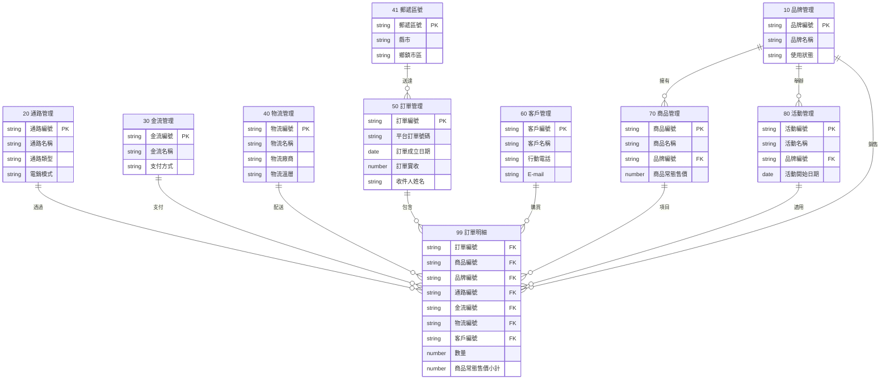
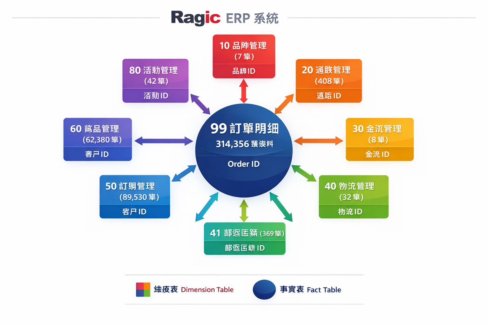
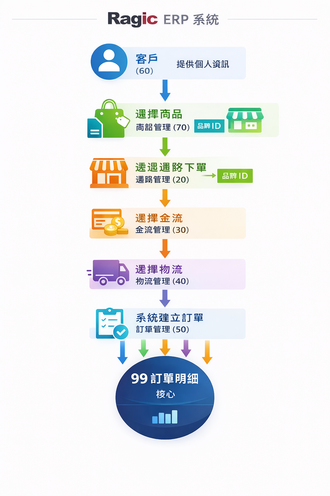
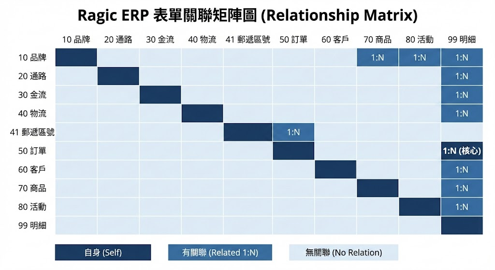
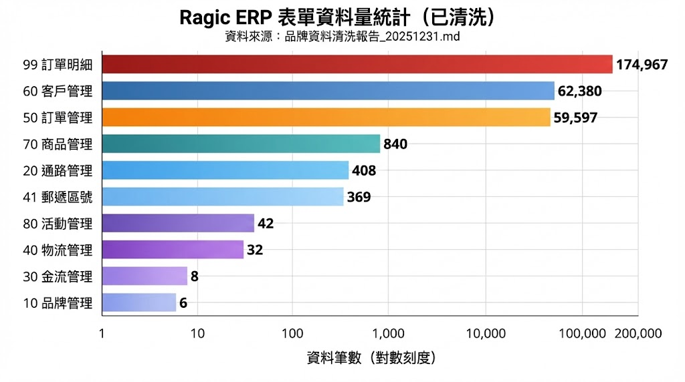

# Ragic ERP 表單結構與關聯性分析

**分析日期**: 2025-12-31  
**資料來源**: Ragic ERP 系統（grefun 帳號）  
**資料狀態**: 已清洗（品牌資料清洗報告_20251231.md）  
**分析範圍**: 10 個核心表單

---

## 目錄

1. [表單總覽](#一表單總覽)
2. [各表單功能詳解](#二各表單功能詳解)
3. [表單關聯性分析](#三表單關聯性分析)
4. [星狀模型架構](#四星狀模型架構)
5. [資料流向圖](#五資料流向圖)
6. [圖示](#六圖示)

---

## 一、表單總覽

### 表單清單

| 代碼 | 表單名稱 | 類型 | 筆數 | 主鍵欄位 | 說明 |
|:----:|---------|:----:|-----:|---------|------|
| 10 | 品牌管理 | 維度表 | 6 | 品牌編號 | 品牌基本資料 |
| 20 | 通路管理 | 維度表 | 408 | 通路編號 | 銷售通路資料 |
| 30 | 金流管理 | 維度表 | 8 | 金流編號 | 支付方式定義 |
| 40 | 物流管理 | 維度表 | 32 | 物流編號 | 配送方式定義 |
| 41 | 郵遞區號 | 維度表 | 369 | 郵遞區號 | 地址對照表 |
| 50 | 訂單管理 | 事實表 | 59,597 | 訂單編號 | 訂單主檔 |
| 60 | 客戶管理 | 維度表 | 62,380 | 客戶編號 | 客戶資料 |
| 70 | 商品管理 | 維度表 | 840 | 商品編號 | 商品目錄 |
| 80 | 活動管理 | 維度表 | 42 | 活動編號 | 促銷活動 |
| 99 | 訂單明細 | 事實表 | 174,967 | - | 訂單細項（核心） |

### 表單分類圖

```
┌─────────────────────────────────────────────────────────────┐
│                     Ragic ERP 表單架構                       │
├─────────────────────────────────────────────────────────────┤
│                                                             │
│   ┌─────────────┐     ┌─────────────┐     ┌─────────────┐  │
│   │  維度表群    │     │  事實表群   │     │  輔助表群   │  │
│   │ (Dimension) │     │   (Fact)    │     │ (Reference) │  │
│   ├─────────────┤     ├─────────────┤     ├─────────────┤  │
│   │ 10 品牌管理 │     │ 50 訂單管理 │     │ 41 郵遞區號 │  │
│   │ 20 通路管理 │     │ 99 訂單明細 │     └─────────────┘  │
│   │ 30 金流管理 │     └─────────────┘                      │
│   │ 40 物流管理 │                                          │
│   │ 60 客戶管理 │                                          │
│   │ 70 商品管理 │                                          │
│   │ 80 活動管理 │                                          │
│   └─────────────┘                                          │
│                                                             │
└─────────────────────────────────────────────────────────────┘
```

---

## 二、各表單功能詳解

### 【10】品牌管理

**功能說明**: 管理所有合作品牌的基本資料，作為商品、活動、訂單的品牌維度來源。

| 欄位名稱 | 說明 | 範例 |
|---------|------|------|
| 品牌編號 | 主鍵，3 碼英文 | GMK, HYA, SUN |
| 品牌名稱 | 品牌中文名稱 | 菜市仔嬤, HOYA |
| 使用狀態 | 啟用/停用 | Toggle-On |
| 寄件人 | 出貨單顯示名稱 | 菜市仔嬤 |
| 寄件人電話 | 出貨聯絡電話 | 0800-666-579 |
| 寄件人地址 | 出貨地址 | 高雄市鼓山區... |
| 合約起始/終止日期 | 合作期間 | - |

**關聯表單**: → 70 商品管理、80 活動管理、99 訂單明細

---

### 【20】通路管理

**功能說明**: 管理銷售通路（團購主、電商平台、官網等），記錄通路屬性與聯絡資訊。

| 欄位名稱 | 說明 | 範例 |
|---------|------|------|
| 通路編號 | 主鍵 | SC_001, SC_766 |
| 通路名稱 | 通路名稱 | 官網_一般零售 |
| 通路類型 | 分類 | 官網/社群團購/電商平台 |
| 電銷模式 | 銷售模式 | B2C/B2B/B2C2N |
| 收款方 | 誰收款 | 我方收款/通路收款 |
| 姓名/電話/E-mail | 聯絡資訊 | - |

**關聯表單**: → 99 訂單明細

---

### 【30】金流管理

**功能說明**: 定義支付方式類型。

| 欄位名稱 | 說明 | 範例 |
|---------|------|------|
| 金流編號 | 主鍵 | FA_001, FA_008 |
| 金流名稱 | 名稱 | 信用卡, Apple Pay |
| 支付方式 | 分類 | 信用卡/行動支付/ATM |

**關聯表單**: → 99 訂單明細

---

### 【40】物流管理

**功能說明**: 定義配送方式組合（物流商 + 溫層 + 發貨點 + 取貨點 + 運費方式）。

| 欄位名稱 | 說明 | 範例 |
|---------|------|------|
| 物流編號 | 主鍵 | DV_016, DV_032 |
| 物流名稱 | 完整名稱 | 新竹_冷凍_總倉_宅配_免運 |
| 物流廠商 | 物流商 | 新竹/黑貓/蝦皮 |
| 物流溫層 | 溫度 | 常溫/冷藏/冷凍 |
| 發貨點 | 出貨倉 | 總倉/分倉 |
| 取貨點 | 配送方式 | 宅配/超取 |
| 運費支付方式 | 運費 | 免運/自付運費 |

**關聯表單**: → 99 訂單明細

---

### 【41】郵遞區號

**功能說明**: 台灣郵遞區號對照表，提供地址解析。

| 欄位名稱 | 說明 | 範例 |
|---------|------|------|
| 郵遞區號 | 主鍵 | 100, 236, 800 |
| 縣市 | 縣市名 | 台北市, 新北市 |
| 鄉鎮市區 | 區域名 | 中正區, 土城區 |

**關聯表單**: → 50 訂單管理

---

### 【50】訂單管理

**功能說明**: 訂單主檔，記錄訂單層級的資訊（收件人、金額、發票等）。

| 欄位名稱 | 說明 | 範例 |
|---------|------|------|
| 訂單編號 | 主鍵 | OD_251230036 |
| 平台訂單號碼 | 外部單號 | GMK205253 |
| 訂單成立日期 | 下單日 | 2025/12/29 |
| 訂單實收 | 實收金額 | 1689 |
| 收件人姓名 | 姓名 | 詹淑媛 |
| 收件人電話 | 電話 | 0922749040 |
| 郵遞區號 | 區碼 | 236 |
| 縣市/鄉鎮市區 | 地址 | 新北市土城區 |
| 送貨完整地址 | 完整地址 | - |
| E-mail | 電子郵件 | - |
| 開立發票與否 | 發票 | 開立/不開立 |
| 載具類別/編號 | 電子發票 | - |

**關聯表單**: → 99 訂單明細（1:N）

---

### 【60】客戶管理

**功能說明**: 客戶資料庫，記錄客戶基本資訊。

| 欄位名稱 | 說明 | 範例 |
|---------|------|------|
| 客戶編號 | 主鍵 | AC_064246 |
| 客戶名稱 | 姓名 | 張嘉珣 |
| 行動電話 | 手機 | 0922678342 |
| E-mail | 電子郵件 | - |
| 通訊完整地址 | 地址 | - |
| 生日/星座 | 個人資料 | - |
| 買受人身份 | 發票身份 | 自然人/法人 |
| 統一編號/發票抬頭 | 公司資料 | - |

**關聯表單**: → 99 訂單明細

---

### 【70】商品管理

**功能說明**: 商品目錄，管理所有品牌的商品資料。

| 欄位名稱 | 說明 | 範例 |
|---------|------|------|
| 商品編號 | 主鍵 | PD_GMK469 |
| 商品名稱 | 名稱 | 嘗鮮試菜組（B組） |
| 品牌編號 | 外鍵 | GMK |
| 商品建議售價 | 定價 | 1282 |
| 商品常態售價 | 售價 | 1282 |
| 商品結構 | 類型 | 單品/組合 |
| 商品系列 | 分類 | 餛飩/綜合 |
| 商品內容 | 描述 | - |

**關聯表單**: ← 10 品牌管理、→ 99 訂單明細

---

### 【80】活動管理

**功能說明**: 促銷活動管理，定義活動規則與期間。

| 欄位名稱 | 說明 | 範例 |
|---------|------|------|
| 活動編號 | 主鍵 | MK_043 |
| 活動名稱 | 名稱 | 進香不累 |
| 品牌編號 | 外鍵 | HYA |
| 活動平台 | 平台 | 官網 |
| 通路活動號碼 | 對應碼 | - |
| 活動開始/結束日期 | 期間 | - |
| 活動等級 | 層級 | 通路/品牌 |
| 回饋類型 | 類型 | 折扣比例/贈品 |

**關聯表單**: ← 10 品牌管理、→ 99 訂單明細（通路活動號碼）

---

### 【99】訂單明細

**功能說明**: **核心事實表**，記錄每筆訂單的商品明細，並彙整所有維度資訊。

**欄位數量**: 93 個（含冗餘欄位）

**主要欄位群組**:

| 群組 | 來源表單 | 欄位範例 |
|------|---------|---------|
| 品牌資訊 | 10 品牌管理 | 品牌編號、品牌名稱 |
| 通路資訊 | 20 通路管理 | 通路編號、通路名稱、電銷模式、收款方 |
| 金流資訊 | 30 金流管理 | 金流編號、金流名稱、支付方式 |
| 物流資訊 | 40 物流管理 | 物流編號、物流廠商、物流溫層、運費 |
| 訂單資訊 | 50 訂單管理 | 訂單編號、訂單成立日期、訂單實收 |
| 客戶資訊 | 60 客戶管理 | 客戶編號、客戶名稱、行動電話、E-mail |
| 商品資訊 | 70 商品管理 | 商品編號、商品名稱、數量、售價小計 |
| 活動資訊 | 80 活動管理 | 通路活動號碼1~5 |

---

## 三、表單關聯性分析

### 關聯矩陣

```
            10   20   30   40   41   50   60   70   80   99
         品牌 通路 金流 物流 郵遞 訂單 客戶 商品 活動 明細
    ┌────────────────────────────────────────────────────┐
 10 │  ●                             ←         ←     →  │
 20 │       ●                                       →   │
 30 │            ●                                  →   │
 40 │                 ●                             →   │
 41 │                      ●    →                       │
 50 │                           ●              1:N →    │
 60 │                                ●              →   │
 70 │  ←                                  ●         →   │
 80 │  ←                                       ●    →   │
 99 │  ←    ←    ←    ←         ←    ←    ←    ←    ●   │
    └────────────────────────────────────────────────────┘

    圖例: ● 自身  → 參照到  ← 被參照
```

### 關聯詳細說明

| 來源表單 | 目標表單 | 關聯欄位 | 關聯類型 | 說明 |
|---------|---------|---------|:--------:|------|
| 10 品牌 | 70 商品 | 品牌編號 | 1:N | 一個品牌有多個商品 |
| 10 品牌 | 80 活動 | 品牌編號 | 1:N | 一個品牌有多個活動 |
| 10 品牌 | 99 明細 | 品牌編號 | 1:N | 冗餘欄位 |
| 20 通路 | 99 明細 | 通路編號 | 1:N | 一個通路有多筆明細 |
| 30 金流 | 99 明細 | 金流編號 | 1:N | 一種金流有多筆明細 |
| 40 物流 | 99 明細 | 物流編號 | 1:N | 一種物流有多筆明細 |
| 41 郵遞 | 50 訂單 | 郵遞區號 | 1:N | 地址參照 |
| 50 訂單 | 99 明細 | 訂單編號 | 1:N | **核心關聯** |
| 60 客戶 | 99 明細 | 客戶編號 | 1:N | 一個客戶有多筆明細 |
| 70 商品 | 99 明細 | 商品編號 | 1:N | 一個商品有多筆明細 |
| 80 活動 | 99 明細 | 通路活動號碼 | 1:N | 活動套用 |

---

## 四、星狀模型架構

### 概念圖

```
                              ┌─────────────┐
                              │  10 品牌    │
                              │  (6 筆)     │
                              └──────┬──────┘
                                     │
         ┌─────────────┐             │             ┌─────────────┐
         │  20 通路    │             │             │  70 商品    │
         │  (408 筆)   │             │             │  (840 筆)   │
         └──────┬──────┘             │             └──────┬──────┘
                │                    │                    │
                │     ┌─────────────┐│┌─────────────┐     │
                │     │  30 金流    │││  80 活動    │     │
                │     │  (8 筆)     │││  (42 筆)    │     │
                │     └──────┬──────┘│└──────┬──────┘     │
                │            │       │       │            │
                ▼            ▼       ▼       ▼            ▼
         ┌─────────────────────────────────────────────────────┐
         │                                                     │
         │                   99 訂單明細                        │
         │                   (174,967 筆)                      │
         │                                                     │
         │                  ★ 事實表 (Fact Table) ★            │
         │                                                     │
         └─────────────────────────────────────────────────────┘
                ▲            ▲       ▲       ▲            ▲
                │            │       │       │            │
                │     ┌──────┴──────┐│┌──────┴──────┐     │
                │     │  40 物流    │││  41 郵遞    │     │
                │     │  (32 筆)    │││  (369 筆)   │     │
                │     └─────────────┘│└─────────────┘     │
                │                    │                    │
         ┌──────┴──────┐             │             ┌──────┴──────┐
         │  50 訂單    │             │             │  60 客戶    │
         │  (59,597 筆)│             │             │  (62,380 筆)│
         └─────────────┘             │             └─────────────┘
                              ┌──────┴──────┐
                              │   訂單明細   │
                              │  =核心事實表 │
                              └─────────────┘
```

### Mermaid 關聯圖



---

## 五、資料流向圖

### 訂單建立流程

```
┌────────────────────────────────────────────────────────────────────┐
│                        訂單建立資料流                               │
└────────────────────────────────────────────────────────────────────┘

  ┌─────────┐                                           ┌─────────┐
  │  客戶   │ ─────────────────────────────────────────▶│  訂單   │
  │  (60)   │  提供: 姓名、電話、地址、E-mail           │  (50)   │
  └─────────┘                                           └────┬────┘
                                                             │
                                                             │ 建立
                                                             ▼
  ┌─────────┐     ┌─────────┐     ┌─────────┐      ┌────────────────┐
  │  通路   │────▶│         │◀────│  金流   │      │                │
  │  (20)   │     │         │     │  (30)   │      │   訂單明細     │
  └─────────┘     │  訂單   │     └─────────┘      │    (99)        │
                  │  明細   │                       │                │
  ┌─────────┐     │  (99)   │     ┌─────────┐      │  ★ 核心事實表  │
  │  物流   │────▶│         │◀────│  商品   │      │                │
  │  (40)   │     │         │     │  (70)   │      └────────────────┘
  └─────────┘     └────┬────┘     └────┬────┘
                       │               │
                       │               │
                       ▼               ▼
                  ┌─────────┐     ┌─────────┐
                  │  品牌   │◀────│  活動   │
                  │  (10)   │     │  (80)   │
                  └─────────┘     └─────────┘
```

### 維度表資料量比較

```
資料量比較（對數刻度）

訂單明細 ████████████████████████████████████████████████ 174,967
訂單管理 █████████████████████████████████████            59,597
客戶管理 ████████████████████████████                     62,380
商品管理 ██                                                  840
通路管理 █                                                   408
郵遞區號 █                                                   369
活動管理 ▏                                                    42
物流管理 ▏                                                    32
金流管理 ▏                                                     8
品牌管理 ▏                                                     6
```

---

## 六、圖示

### 圖示 1：星狀模型架構圖



**說明**：展示 Ragic ERP 系統的星狀模型架構，核心事實表（99 訂單明細）位於中央，周圍環繞 9 個維度表，呈現完整的資料倉儲結構。

---

### 圖示 2：資料流向圖



**說明**：呈現 Ragic ERP 訂單處理的完整資料流程，從客戶提供資訊、選擇商品、透過通路下單、選擇金流與物流，最終匯聚至訂單明細核心。

---

### 圖示 3：表單關聯矩陣視覺化



**說明**：10x10 關聯矩陣圖，清楚標示各表單之間的關聯關係，對角線為自身關聯，其他格子顯示 1:N 關聯類型。

---

### 圖示 4：維度表資料量比較圖



**說明**：橫條圖展示各表單的資料量統計（已清洗），使用對數刻度呈現，事實表與維度表以不同色系區分。資料來源：品牌資料清洗報告_20251231.md。數據範圍：99 訂單明細（174,967 筆）至 10 品牌管理（6 筆）。

---

### 圖示 5：ERP 系統概念圖


**說明**：Ragic ERP 系統的概念架構圖，展示六大模組（基礎資料、銷售通路、商品管理、客戶關係、交易處理、核心資料倉儲）及其資料流動關係。

---

## 附錄

### A. 編號規則

| 表單 | 編號格式 | 範例 |
|------|---------|------|
| 品牌 | 3 碼英文 | GMK, HYA |
| 通路 | SC_XXX | SC_001, SC_766 |
| 金流 | FA_XXX | FA_001, FA_008 |
| 物流 | DV_XXX | DV_016, DV_032 |
| 訂單 | OD_YYMMDDNNN | OD_251230036 |
| 客戶 | AC_XXXXXX | AC_064246 |
| 商品 | PD_品牌編號+序號 | PD_GMK469 |
| 活動 | MK_XXX | MK_043 |

### B. 資料量統計

| 表單 | 筆數 | 佔比 |
|------|-----:|-----:|
| 99 訂單明細 | 174,967 | 58.4% |
| 50 訂單管理 | 59,597 | 19.9% |
| 60 客戶管理 | 62,380 | 20.8% |
| 70 商品管理 | 840 | 0.3% |
| 20 通路管理 | 408 | 0.1% |
| 41 郵遞區號 | 369 | 0.1% |
| 80 活動管理 | 42 | <0.1% |
| 40 物流管理 | 32 | <0.1% |
| 30 金流管理 | 8 | <0.1% |
| 10 品牌管理 | 6 | <0.1% |
| **總計** | **299,649** | **100%** |

---

*文件產生時間: 2025-12-31*
