# RagicEDP 專案視覺化圖解集

**版本**: v1.0  
**建立日期**: 2025-12-22  
**用途**: 客戶快速了解 RagicEDP 專案規劃的視覺化說明文件

---

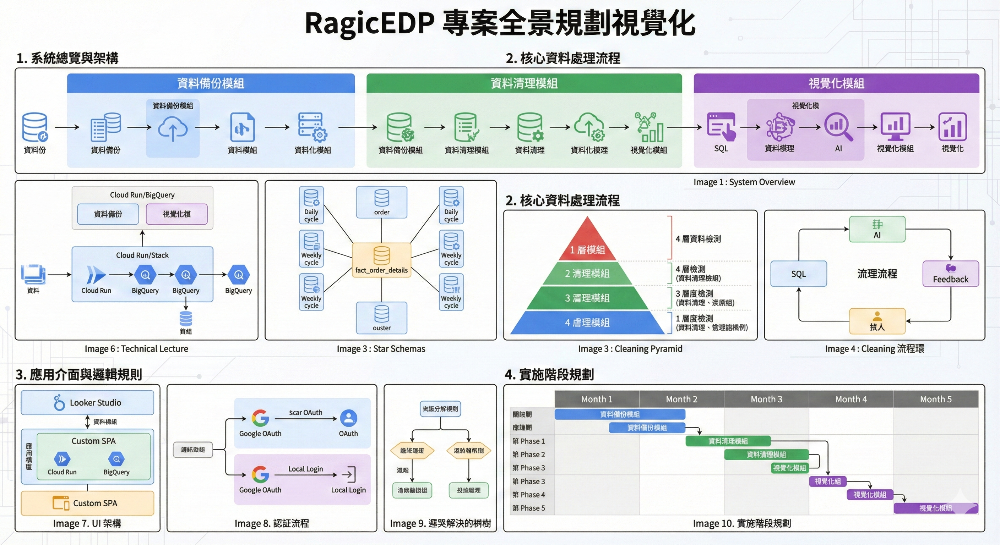

---

## 目錄

1. [系統總覽圖](#1-系統總覽圖)
2. [資料備份流程圖](#2-資料備份流程圖)
3. [資料清理四層檢測架構](#3-資料清理四層檢測架構)
4. [資料清理處理流程](#4-資料清理處理流程)
5. [星狀模型結構圖](#5-星狀模型結構圖)
6. [技術架構圖](#6-技術架構圖)
7. [人工審核介面架構](#7-人工審核介面架構)
8. [認證流程圖](#8-認證流程圖)
9. [衝突處理流程](#9-衝突處理流程)
10. [實施階段規劃圖](#10-實施階段規劃圖)

---

## 1. 系統總覽圖

**標題**: RagicEDP 三大核心模組總覽

**說明**: 展示三大核心模組及其關係，讓客戶快速理解系統架構

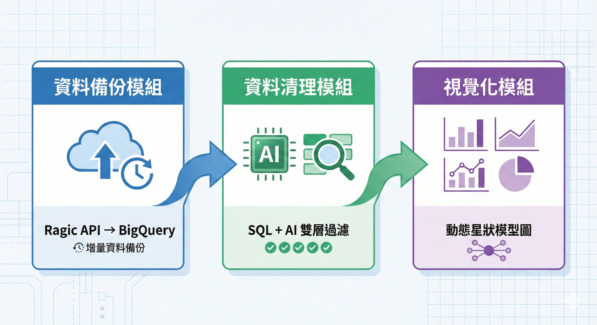

**重點說明**:
- **資料備份模組**（藍色系）：從 Ragic API 增量備份至 BigQuery
- **資料清理模組**（綠色系）：SQL + AI 雙層過濾的資料品質管理
- **視覺化模組**（紫色系）：動態星狀模型圖繪製

---

## 2. 資料備份流程圖

**標題**: 每日增量備份與週報告流程

**說明**: 清楚展示每日備份與週報告的時序流程

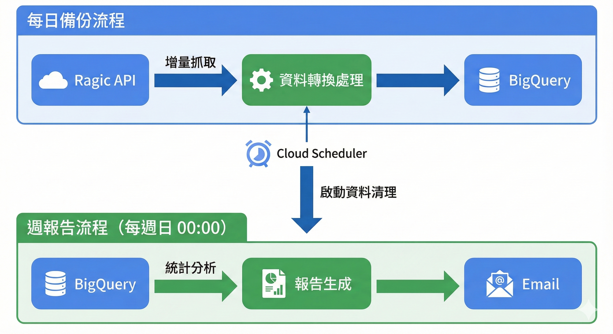

**重點說明**:
- **每日備份流程**：Ragic API → 資料轉換 → BigQuery，由 Cloud Scheduler 每日觸發
- **週報告流程**：每週日 00:00 自動執行統計分析並發送 Email 報告
- 備份完成後自動啟動資料清理流程

---

## 3. 資料清理四層檢測架構

**標題**: 四層資料異常檢測系統

**說明**: 視覺化四層檢測架構的層次關係與檢測重點

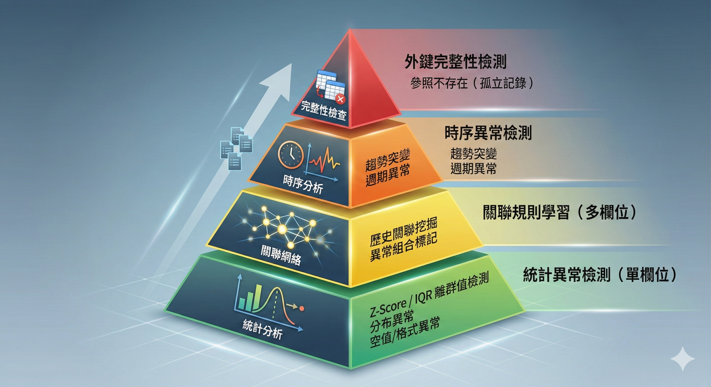

**重點說明**:
- **Layer 1（基礎層）**：統計異常檢測（單欄位）- Z-Score / IQR 離群值檢測
- **Layer 2（關聯層）**：關聯規則學習（多欄位）- 歷史關聯挖掘與異常組合標記
- **Layer 3（時序層）**：時序異常檢測 - 趨勢突變與週期異常
- **Layer 4（完整性層）**：外鍵完整性檢測 - 參照不存在（孤立記錄）

---

## 4. 資料清理處理流程

**標題**: SQL → AI → 人工審核 → 回饋學習完整流程

**說明**: 展示資料清理的完整處理流程與回饋機制

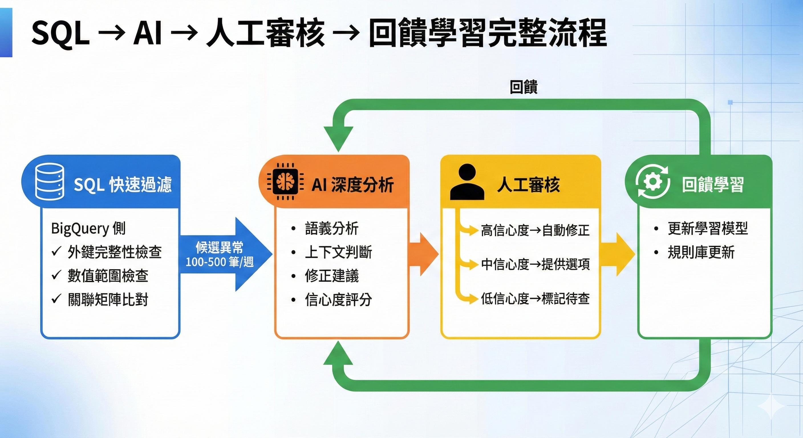

**重點說明**:
1. **SQL 快速過濾**：在 BigQuery 側進行外鍵完整性、數值範圍、關聯矩陣檢查，輸出候選異常（100-500 筆/週）
2. **AI 深度分析**：對候選資料進行語義分析、上下文判斷、修正建議與信心度評分
3. **人工審核**：根據信心度分級處理（高→自動修正、中→提供選項、低→標記待查）
4. **回饋學習**：人工審核結果回饋至學習模型與規則庫，持續優化檢測準確度

---

## 5. 星狀模型結構圖

**標題**: BigQuery 星狀模型資料表關聯

**說明**: 清楚展示資料倉儲的星狀模型結構

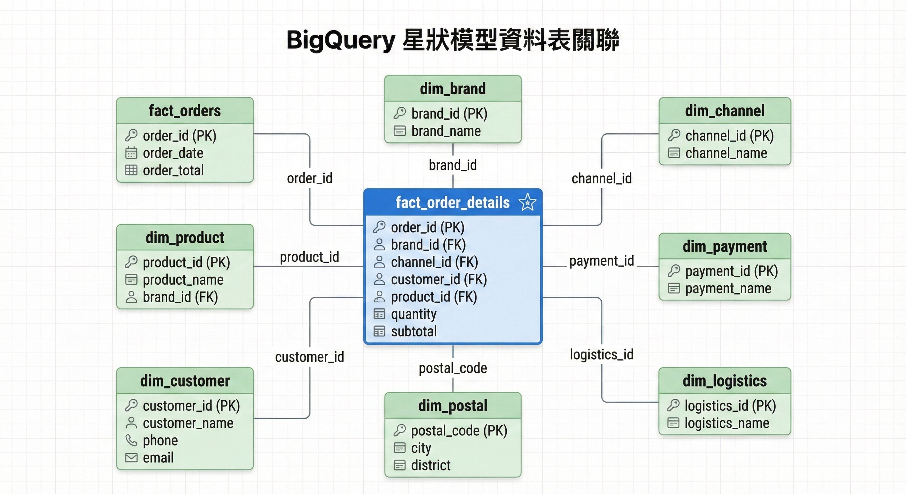

**重點說明**:
- **事實表（中心）**：`fact_order_details` - 訂單明細事實表，包含訂單、品牌、通路、客戶、商品等外鍵
- **維度表（周圍）**：
  - `dim_brand` - 品牌維度表
  - `dim_channel` - 通路維度表
  - `dim_payment` - 金流維度表
  - `dim_logistics` - 物流維度表
  - `dim_postal` - 郵遞區號維度表
  - `dim_customer` - 客戶維度表
  - `dim_product` - 商品維度表
  - `fact_orders` - 訂單事實表

---

## 6. 技術架構圖

**標題**: RagicEDP 完整技術架構

**說明**: 展示完整的技術堆疊與服務整合

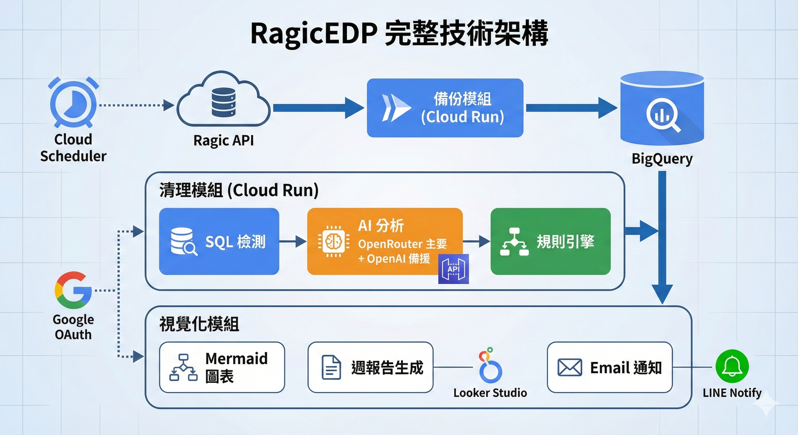

**重點說明**:
- **執行環境**：Google Cloud Run（無伺服器、按需擴展）
- **排程服務**：Cloud Scheduler（每日/每週觸發）
- **資料庫**：BigQuery（資料倉儲）
- **AI 引擎**：OpenRouter（主要）+ OpenAI（備援）
- **通知機制**：Email + LINE Notify
- **審核介面**：Vue 3 + Element Plus + FastAPI
- **報表工具**：Looker Studio（儀表板與趨勢分析）
- **認證機制**：Google OAuth 2.0 + 本地帳密

---

## 7. 人工審核介面架構

**標題**: 審核介面雙層架構設計

**說明**: 展示審核介面的雙層設計與功能模組

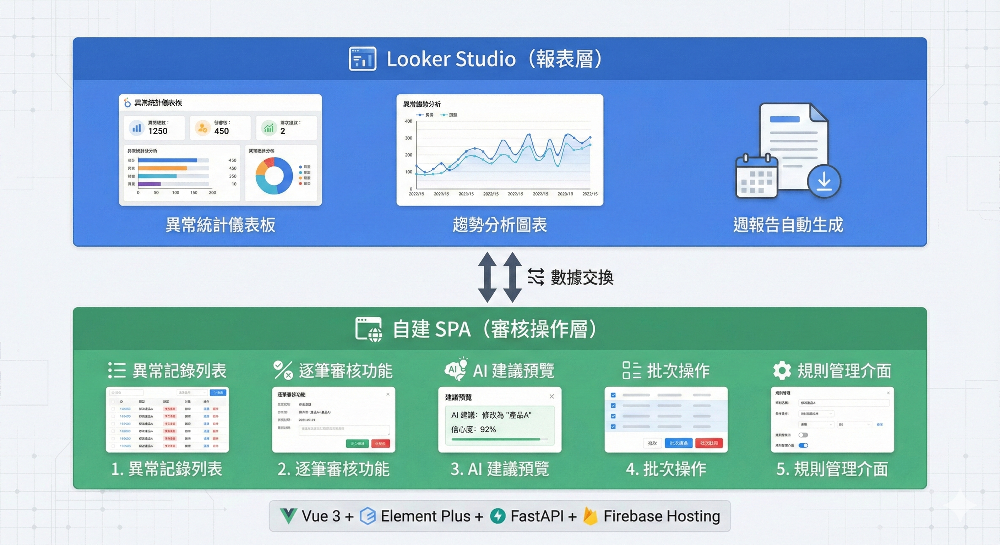

**重點說明**:
- **Looker Studio（報表層）**：
  - 異常統計儀表板
  - 趨勢分析圖表
  - 週報告自動生成

- **自建 SPA（審核操作層）**：
  - 異常記錄列表（支援篩選、排序、分頁）
  - 逐筆審核功能（通過/拒絕/修正/跳過）
  - AI 建議預覽
  - 批次操作
  - 規則管理介面

- **技術堆疊**：Vue 3 + Element Plus + FastAPI + Firebase Hosting

---

## 8. 認證流程圖

**標題**: 雙重認證機制流程

**說明**: 清楚展示兩種認證方式的流程與角色權限

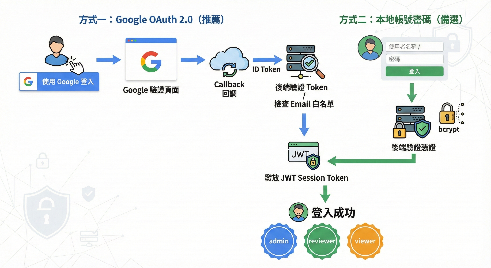

**重點說明**:
- **方式一：Google OAuth 2.0（推薦）**
  1. 使用者點擊「使用 Google 登入」
  2. Google 認證頁面
  3. 返回 callback，取得 ID Token
  4. 後端驗證 Token，檢查 Email 是否在白名單
  5. 發放 JWT Session Token
  6. 登入成功

- **方式二：本地帳號密碼（備選）**
  1. 輸入帳號密碼
  2. 後端驗證（bcrypt hash）
  3. 發放 JWT Session Token
  4. 登入成功

- **角色權限**：
  - **admin**：全部權限（審核、規則管理、使用者管理）
  - **reviewer**：審核權限（查看、審核異常記錄）
  - **viewer**：唯讀權限（查看報表和儀表板）

---

## 9. 衝突處理流程

**標題**: 多規則衝突處理策略

**說明**: 展示多規則衝突時的處理邏輯與優先順序

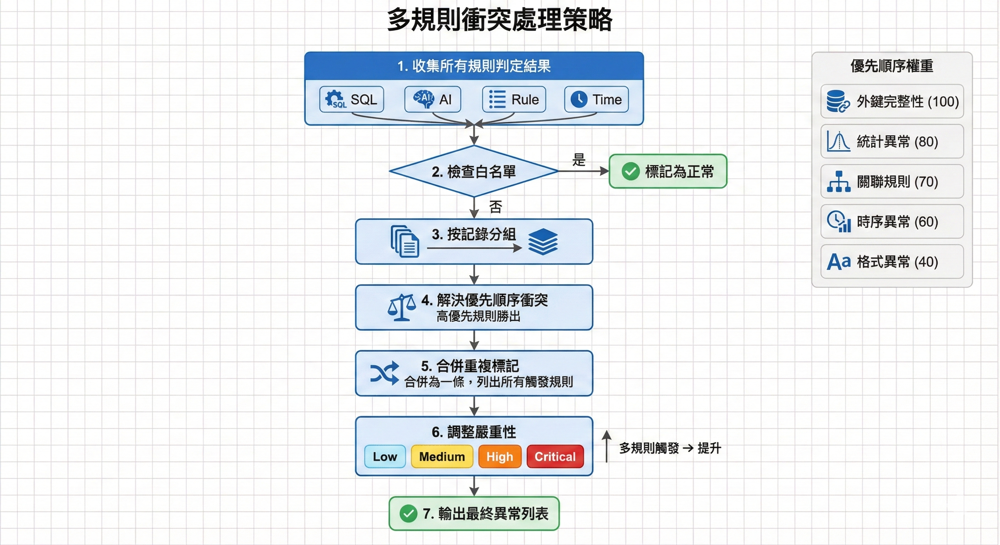

**重點說明**:
1. **收集所有規則判定結果**
2. **檢查白名單**：白名單內直接標記為正常
3. **按記錄分組**
4. **解決優先順序衝突**：高優先規則勝出
5. **合併重複標記**：合併為一條，列出所有觸發規則
6. **調整嚴重性**：多規則觸發時提升嚴重性等級
7. **輸出最終異常列表**

**規則優先順序權重**：
- 外鍵完整性：100（最高優先）
- 統計異常：80
- 關聯規則：70
- 時序異常：60
- 格式異常：40（最低優先）

---

## 10. 實施階段規劃圖

**標題**: 四階段實施計劃時程

**說明**: 展示專案實施的四個階段與任務清單

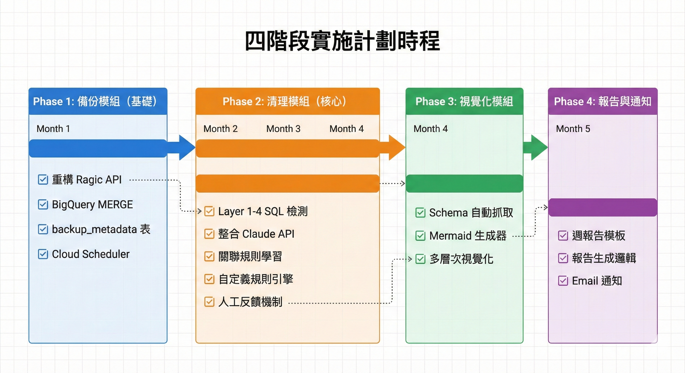

**重點說明**:
- **Phase 1：備份模組（基礎）**
  - 重構 Ragic API 客戶端，支援增量抓取
  - 實現 BigQuery MERGE 增量更新
  - 建立 backup_metadata 追蹤表
  - 配置 Cloud Scheduler 每日觸發

- **Phase 2：清理模組（核心）**
  - 實現 Layer 1-4 SQL 檢測
  - 整合 OpenRouter/OpenAI API 進行 AI 分析
  - 建立關聯規則學習機制
  - 實現自定義規則引擎
  - 建立人工反饋回饋機制

- **Phase 3：視覺化模組**
  - 實現 Schema 自動抓取
  - 開發 Mermaid 圖表生成器
  - 建立多層次視覺化

- **Phase 4：報告與通知**
  - 設計週報告模板
  - 實現報告生成邏輯
  - 配置 Email + LINE 通知

---

## 總結

本視覺化圖解集涵蓋了 RagicEDP 專案的完整規劃，從系統架構、資料流程、技術選型到實施計劃，提供客戶快速理解專案全貌的視覺化說明。

### 核心價值

1. **自動化備份**：每日增量備份，確保資料同步
2. **智慧清理**：四層檢測 + AI 分析，提升資料品質
3. **視覺化呈現**：動態星狀模型圖，清晰展示資料結構
4. **人工審核**：雙層介面設計，提升審核效率
5. **完整流程**：從備份到清理到報告的完整資料管理流程

### 技術優勢

- **無伺服器架構**：Cloud Run 按需擴展，降低運維成本
- **AI 驅動**：OpenRouter + OpenAI 雙引擎，確保服務可用性
- **現代化介面**：Vue 3 + Element Plus，提供優質使用者體驗
- **完整認證**：Google OAuth + 本地帳密，雙重保障

---

**文件版本**: v1.0  
**最後更新**: 2025-12-22  
**圖片生成時間**: 2025-12-22 14:30 - 14:43

